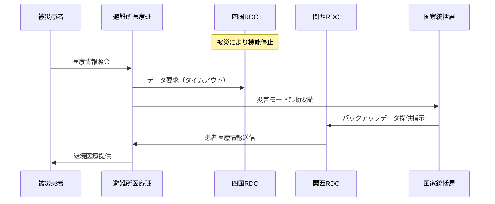

# 日本版医療データスペース フェデレーションアーキテクチャ設計書

## 1. アーキテクチャ概要

### 1.1 基本コンセプト: 「3層ハイブリッド・フェデレーション」

```
┌─────────────────────────────────────────────────────────┐
│                    国家統括層（中央）                      │
│  ・日本医療データ機構（JMDO: Japan Medical Data Organization）│
│  ・標準規格管理・セキュリティ監査・国際連携              │
└─────────────────────────────────────────────────────────┘
                            ↑↓
┌─────────────────────────────────────────────────────────┐
│                  地域医療圏層（8ブロック）               │
│  ・北海道・東北・関東・中部・関西・中国・四国・九州      │
│  ・地域データセンター（RDC: Regional Data Center）       │
└─────────────────────────────────────────────────────────┘
                            ↑↓
┌─────────────────────────────────────────────────────────┐
│                   医療提供層（47都道府県）               │
│  ・都道府県医療ネットワーク                              │
│  ・医療機関・薬局・介護施設                              │
└─────────────────────────────────────────────────────────┘
```

### 1.2 設計原則

1. **地域自律性**: 各地域医療圏が独自の運用ポリシーを持ちながら相互接続
2. **災害耐性**: 複数地域センターによる相互バックアップ体制
3. **段階的統合**: 既存システムを活かした漸進的な統合
4. **国際標準準拠**: HL7 FHIR JP Core準拠による相互運用性確保

## 2. 具体的システム構成

### 2.1 国家統括層: 日本医療データ機構（JMDO）

#### 役割と機能
```yaml
中央統括機能:
  - 技術標準策定・更新
  - セキュリティポリシー管理
  - 全国データカタログ管理
  - 国際連携ゲートウェイ
  - AI/MLモデル共通基盤

設置場所:
  主センター: 東京（霞が関データセンター）
  副センター: 大阪（西日本バックアップ）
  
年間予算: 約150億円
人員規模: 200名（技術者100名、政策50名、運用50名）
```

### 2.2 地域医療圏層: 地域データセンター（RDC）

#### 8つの地域医療圏とセンター配置

```yaml
1. 北海道ブロック:
   センター: 札幌
   対象: 北海道
   医療機関: 約570施設
   特徴: 広域分散、遠隔医療重視

2. 東北ブロック:
   センター: 仙台
   対象: 青森、岩手、宮城、秋田、山形、福島
   医療機関: 約1,200施設
   特徴: 震災対応、医師偏在対策

3. 関東ブロック:
   センター: 東京（品川）
   サブセンター: 横浜、さいたま
   対象: 東京、神奈川、埼玉、千葉、茨城、栃木、群馬、山梨
   医療機関: 約15,000施設
   特徴: 最大規模、高度医療集積

4. 中部ブロック:
   センター: 名古屋
   対象: 新潟、富山、石川、福井、長野、岐阜、静岡、愛知、三重
   医療機関: 約4,500施設
   特徴: 製造業連携、産業医療

5. 関西ブロック:
   センター: 大阪
   サブセンター: 京都、神戸
   対象: 滋賀、京都、大阪、兵庫、奈良、和歌山
   医療機関: 約7,000施設
   特徴: 医療産業集積、研究開発

6. 中国ブロック:
   センター: 広島
   対象: 鳥取、島根、岡山、広島、山口
   医療機関: 約2,000施設
   特徴: 高齢化対応、過疎地医療

7. 四国ブロック:
   センター: 高松
   対象: 徳島、香川、愛媛、高知
   医療機関: 約1,500施設
   特徴: 離島医療、コンパクト運営

8. 九州・沖縄ブロック:
   センター: 福岡
   サブセンター: 那覇
   対象: 福岡、佐賀、長崎、熊本、大分、宮崎、鹿児島、沖縄
   医療機関: 約4,500施設
   特徴: 離島対応、国際医療観光
```

### 2.3 医療提供層: 接続パターン

#### 大規模病院（400床以上）
```yaml
接続方式: 直接接続型
技術仕様:
  - API: HL7 FHIR R4 JP Core
  - 認証: OAuth 2.0 + OpenID Connect
  - 通信: TLS 1.3
  - リアルタイム同期

必要設備:
  - 専用サーバー（オンプレミス/プライベートクラウド）
  - 冗長回線（100Mbps以上）
  - 24時間監視体制
```

#### 中規模病院（100-399床）
```yaml
接続方式: ゲートウェイ型
技術仕様:
  - 地域医療連携システム経由
  - バッチ処理（1日4回）
  - 標準変換サービス利用

支援内容:
  - 変換アダプター無償提供
  - 技術支援（月1回）
  - 運用代行オプション
```

#### 診療所・クリニック
```yaml
接続方式: クラウドサービス型
技術仕様:
  - SaaS型接続サービス
  - Web API経由
  - 最小限データセット

料金体系:
  - 基本料金: 月額1万円
  - 従量課金: 1,000件あたり500円
  - 初期費用: 10万円（補助金適用後）
```

## 3. 具体的実装例

### 3.1 ユースケース1: 災害時医療情報共有

#### シナリオ: 南海トラフ地震発生時



#### 実装詳細
```yaml
災害時自動切替:
  検知: 
    - RDC応答なし30秒
    - 地震速報API連動
  
  切替時間: 最大60秒
  
  データ同期:
    - 平常時: 15分間隔でレプリケーション
    - 重要データ: リアルタイム3重化
    
  復旧手順:
    - 自動フェイルバック
    - データ整合性チェック
    - 段階的負荷移行
```

### 3.2 ユースケース2: 高齢者在宅医療連携

#### シナリオ: 認知症患者の包括ケア

```yaml
関係者:
  - かかりつけ医（診療所）
  - 訪問看護ステーション
  - 地域包括支援センター
  - 調剤薬局
  - 家族（見守りアプリ）

データフロー:
  1. 日常記録:
     - バイタルデータ自動収集（IoT機器）
     - 服薬記録（薬局システム）
     - 訪問看護記録
     
  2. アラート連携:
     - 異常値検知→かかりつけ医通知
     - 服薬忘れ→家族・薬局通知
     - 転倒検知→救急連携
     
  3. 情報共有範囲:
     - レベル1: 緊急情報のみ（全関係者）
     - レベル2: 日常ケア情報（医療・介護職）
     - レベル3: 詳細医療情報（医師のみ）
```

### 3.3 ユースケース3: AI診断支援ネットワーク

#### シナリオ: 離島診療所での専門診断支援

```python
# 実装例: 画像診断支援API

class RemoteDiagnosisAPI:
    def __init__(self, clinic_id, region_rdc):
        self.clinic_id = clinic_id
        self.rdc = region_rdc
        self.ai_models = {
            'chest_xray': 'JMDO-CXR-Model-v2.1',
            'skin_lesion': 'JMDO-Derma-Model-v1.8',
            'retinal': 'JMDO-Retina-Model-v3.0'
        }
    
    async def request_diagnosis(self, image_data, exam_type):
        # 1. 地域RDCへ画像送信
        encrypted_data = self.encrypt(image_data)
        job_id = await self.rdc.submit_job(encrypted_data, exam_type)
        
        # 2. AI解析（専門医レビュー付き）
        ai_result = await self.rdc.analyze(job_id, self.ai_models[exam_type])
        
        # 3. 専門医確認（緊急度に応じて）
        if ai_result.confidence < 0.8 or ai_result.severity == 'high':
            specialist = await self.rdc.request_specialist_review(job_id)
            return {
                'ai_diagnosis': ai_result,
                'specialist_opinion': specialist.opinion,
                'recommended_action': specialist.recommendation
            }
        
        return {'ai_diagnosis': ai_result}
```

## 4. 技術仕様

### 4.1 データ標準

```yaml
基本仕様:
  データフォーマット: HL7 FHIR R4 JP Core v1.1
  
  必須リソース:
    - Patient（患者基本情報）
    - Observation（検査結果）
    - MedicationRequest（処方）
    - AllergyIntolerance（アレルギー）
    - Condition（診断）
    - Procedure（処置）
  
  拡張プロファイル:
    - JP_Patient（日本固有の患者情報）
    - JP_Coverage（保険情報）
    - JP_Organization（医療機関情報）

文字コード: UTF-8
日付時刻: ISO 8601（JST）
用語集: MEDIS標準マスター
```

### 4.2 セキュリティ仕様

```yaml
認証・認可:
  医療従事者: HPKIカード + 生体認証
  患者: マイナンバーカード + SMS認証
  システム間: mTLS + OAuth 2.0

暗号化:
  保存時: AES-256-GCM
  転送時: TLS 1.3
  鍵管理: HSM（Hardware Security Module）

監査ログ:
  保存期間: 10年
  改ざん防止: ブロックチェーン記録
  アクセス記録: 全操作をトレース可能
```

### 4.3 性能要件

```yaml
可用性:
  SLA: 99.99%（年間52分以内の停止）
  RPO: 15分（データ損失許容時間）
  RTO: 1時間（復旧時間目標）

応答性能:
  データ参照: 3秒以内（95パーセンタイル）
  データ登録: 5秒以内（95パーセンタイル）
  バッチ処理: 6時間以内（日次）

拡張性:
  初期: 1,000万人
  3年後: 5,000万人
  最終: 1.2億人（全国民）
```

## 5. 段階的実装計画

### Phase 1: 基盤構築期（2025-2026）

```yaml
2025年Q1-Q2:
  - 法制度整備（医療データ基本法）
  - JMDO設立準備
  - 技術仕様確定

2025年Q3-Q4:
  - パイロット地域選定（5県）
  - 関東・関西RDC構築開始
  - 大規模病院との接続テスト

2026年Q1-Q2:
  - パイロット運用開始
  - 100医療機関接続
  - 効果測定・改善

2026年Q3-Q4:
  - 全8地域RDC構築完了
  - 標準化ツール配布
  - 医療従事者研修開始
```

### Phase 2: 展開期（2027-2028）

```yaml
接続目標:
  2027年: 1,000医療機関（全体の5%）
  2028年: 10,000医療機関（全体の50%）

重点施策:
  - 中小医療機関支援プログラム
  - 地域医療連携推進事業
  - AI診断支援サービス開始
```

### Phase 3: 完成期（2029-2030）

```yaml
最終目標:
  - 全医療機関接続（20,000施設）
  - 国民の80%がアクセス可能
  - アジア太平洋連携開始

国際展開:
  - ASEAN医療データ連携
  - 日-EU医療データブリッジ
  - WHO標準への貢献
```

## 6. 投資計画と期待効果

### 6.1 必要投資

```yaml
初期投資（2025-2026）:
  インフラ構築: 300億円
  システム開発: 200億円
  人材育成: 50億円
  補助金: 150億円
  合計: 700億円

年間運用費（2027年以降）:
  データセンター: 50億円
  人件費: 40億円
  システム保守: 30億円
  研究開発: 30億円
  合計: 150億円/年
```

### 6.2 期待効果

```yaml
定量効果（年間）:
  医療費削減:
    - 重複検査削減: 500億円
    - 薬剤適正化: 200億円
    - 事務効率化: 300億円
    小計: 1,000億円
  
  経済効果:
    - 新規雇用: 10,000人
    - 関連産業: 5,000億円
    - 輸出産業: 1,000億円

定性効果:
  - 医療の質向上
  - 健康寿命延伸
  - 地域格差解消
  - 災害対応力強化
  - 国際競争力向上
```

## 7. リスク対策

### 7.1 技術的リスク

```yaml
レガシーシステム統合:
  対策: 
    - 段階的移行パス提供
    - 変換アダプター開発
    - 並行運用期間設定

サイバーセキュリティ:
  対策:
    - 24時間SOC運用
    - AI異常検知システム
    - 定期的侵入テスト
```

### 7.2 社会的リスク

```yaml
プライバシー懸念:
  対策:
    - オプトイン原則
    - 透明性レポート公開
    - 市民参加型ガバナンス

デジタルディバイド:
  対策:
    - 高齢者向けUI
    - 対面サポート窓口
    - 地域ICT支援員配置
```

## 8. ガバナンス体制

```yaml
意思決定機構:
  医療データ政策委員会:
    - 厚生労働省
    - デジタル庁
    - 医師会代表
    - 患者団体代表
    - 有識者

運営監督:
  JMDO理事会:
    - 理事長（医療情報専門家）
    - 技術担当理事
    - セキュリティ担当理事
    - 地域代表理事（8名）

諮問機関:
  - 倫理委員会
  - 技術諮問委員会
  - 患者アドバイザリーボード
```

## 9. 成功指標（KPI）

```yaml
2027年目標:
  - 接続医療機関: 1,000施設
  - 登録患者数: 1,000万人
  - データ活用件数: 10万件/月
  - 患者満足度: 70%以上

2030年目標:
  - 接続医療機関: 20,000施設
  - 登録患者数: 1億人
  - データ活用件数: 100万件/月
  - 患者満足度: 85%以上
  - 医療費削減効果: 1,000億円/年
```

## 10. 結論

日本版フェデレーション型医療データスペースは、以下の特徴により成功が期待される：

1. **3層構造**: 国・地域・医療機関の役割分担明確化
2. **8地域分散**: 災害対応と地域特性への適応
3. **段階的実装**: 現実的な移行パスの提供
4. **ハイブリッド運用**: 中央統制と地域自律性のバランス
5. **国際標準準拠**: 将来の国際連携への対応

このアーキテクチャにより、日本の医療DXを加速し、世界最高水準の医療データエコシステムを構築することが可能となる。