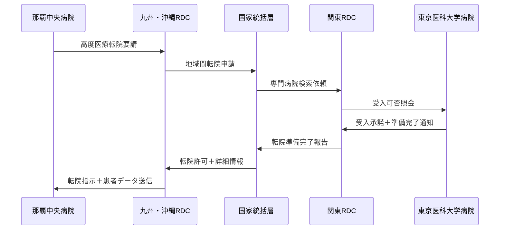

# 日本版フェデレーション型医療データスペース 具体的実装例

## 1. 実運用シナリオ詳細

### 1.1 シナリオA: 多地域転院チェーン

#### 状況設定
```yaml
患者: 山田太郎（75歳、糖尿病・高血圧・心疾患）
経路:
  1. 沖縄県石垣島の診療所で体調不良
  2. 那覇の地域中核病院に搬送
  3. 東京の大学病院に高度医療のため転院
  4. 回復期は横浜の回復期病院
  5. 最終的に石垣島の診療所でフォロー
```

#### データフロー実例

**Step 1: 石垣島診療所 → 九州・沖縄RDC**
```json
{
  "patient_id": "JP-HOSP-47471-001234567",
  "facility": "石垣島診療所",
  "timestamp": "2025-03-15T14:30:00+09:00",
  "emergency_flag": true,
  "symptoms": [
    {
      "code": "R06.00",
      "display": "呼吸困難",
      "severity": "severe"
    }
  ],
  "vital_signs": {
    "blood_pressure": "180/110",
    "pulse": "110",
    "temperature": "38.2"
  },
  "medical_history": {
    "diabetes": "Type2",
    "hypertension": "essential",
    "medications": ["メトホルミン", "アムロジピン"]
  },
  "transfer_request": {
    "destination": "那覇中央病院",
    "urgency": "immediate",
    "reason": "高血圧緊急症疑い"
  }
}
```

**Step 2: 九州・沖縄RDC → 那覇中央病院**
```python
# 自動転送システム
class EmergencyTransferSystem:
    def process_emergency_transfer(self, patient_data):
        # 1. 受け入れ可能病院を検索
        available_hospitals = self.find_capable_hospitals(
            location="那覇市",
            specialties=["循環器内科", "救急医学科"],
            bed_availability=True
        )
        
        # 2. 最適な病院を選択（距離、専門性、空床状況）
        optimal_hospital = self.select_optimal_hospital(available_hospitals)
        
        # 3. 患者データを暗号化して転送
        encrypted_data = self.encrypt_patient_data(patient_data)
        transfer_result = self.secure_transfer(
            data=encrypted_data,
            destination=optimal_hospital,
            priority="emergency"
        )
        
        # 4. 搬送チームに連絡
        self.notify_transport_team(transfer_result)
        
        return transfer_result

# 実行例
transfer_system = EmergencyTransferSystem()
result = transfer_system.process_emergency_transfer(patient_data)
```

**Step 3: 那覇 → 東京間の地域間連携**



### 1.2 シナリオB: 在宅医療IoT連携システム

#### 実装詳細: スマートヘルスケア統合プラットフォーム

```yaml
参加者:
  患者: 佐藤花子（82歳、独居、軽度認知症）
  
  医療・介護チーム:
    - かかりつけ医: 地域診療所
    - 訪問看護師: 地域訪問看護ステーション
    - 介護支援専門員: 地域包括支援センター
    - 薬剤師: 近隣調剤薬局
    
  技術インフラ:
    - IoTデバイス: 血圧計、体重計、活動量計、服薬支援ロボット
    - 見守りシステム: 人感センサー、転倒検知、緊急通報
    - 家族アプリ: 長男・長女（東京・大阪在住）
```

**IoTデータ統合システム**

```python
class HomeHealthcareIoTSystem:
    def __init__(self, patient_id, care_team):
        self.patient_id = patient_id
        self.care_team = care_team
        self.devices = {
            'bp_monitor': BloodPressureMonitor(),
            'weight_scale': SmartScale(),
            'activity_tracker': ActivityTracker(),
            'medication_dispenser': MedicationDispenser(),
            'fall_detector': FallDetectionSensor()
        }
        self.alert_thresholds = {
            'bp_systolic_high': 160,
            'bp_systolic_low': 90,
            'weight_change_24h': 2.0,  # kg
            'activity_daily_steps': 500,  # 最低歩数
            'medication_delay': 30  # 分
        }
    
    async def continuous_monitoring(self):
        while True:
            # 全デバイスからデータ収集
            vital_data = await self.collect_vital_data()
            
            # 異常値検知
            alerts = self.detect_anomalies(vital_data)
            
            if alerts:
                await self.handle_alerts(alerts, vital_data)
            
            # 日常データを地域RDCに送信
            await self.sync_to_rdc(vital_data)
            
            # 5分間隔で監視
            await asyncio.sleep(300)
    
    def detect_anomalies(self, data):
        alerts = []
        
        # 血圧異常
        if data['bp_systolic'] > self.alert_thresholds['bp_systolic_high']:
            alerts.append({
                'type': 'hypertension_crisis',
                'severity': 'high',
                'value': data['bp_systolic'],
                'immediate_action': 'かかりつけ医連絡'
            })
        
        # 転倒検知
        if data.get('fall_detected'):
            alerts.append({
                'type': 'fall_emergency',
                'severity': 'critical',
                'location': data['fall_location'],
                'immediate_action': '救急要請'
            })
        
        # 服薬忘れ
        if data.get('medication_delay') > self.alert_thresholds['medication_delay']:
            alerts.append({
                'type': 'medication_adherence',
                'severity': 'medium',
                'delay_minutes': data['medication_delay'],
                'immediate_action': '家族・薬剤師連絡'
            })
        
        return alerts
    
    async def handle_alerts(self, alerts, data):
        for alert in alerts:
            if alert['severity'] == 'critical':
                # 緊急通報
                await self.emergency_call(alert, data)
                await self.notify_family(alert, urgent=True)
                
            elif alert['severity'] == 'high':
                # かかりつけ医に連絡
                await self.notify_doctor(alert, data)
                await self.notify_care_team(alert)
                
            elif alert['severity'] == 'medium':
                # ケアチーム内で情報共有
                await self.notify_care_team(alert)
            
            # すべてのアラートをログに記録
            await self.log_alert(alert, data)
```

**ケアチーム連携ダッシュボード**

```yaml
訪問看護師用モバイルアプリ:
  リアルタイム表示:
    - 本日のバイタルサイン
    - 前回訪問以降の活動量
    - 服薬遵守状況
    - 家族からの連絡事項
  
  アラート機能:
    - 緊急アラート: 転倒、血圧異常
    - 注意アラート: 活動量低下、体重変化
    - 情報アラート: 服薬時間変更、家族訪問予定
  
  訪問記録:
    - 音声入力による迅速記録
    - 写真・動画での状況記録
    - 他職種への申し送り事項

かかりつけ医用システム:
  患者サマリー:
    - 過去30日のトレンド分析
    - 薬剤効果の定量評価
    - 他院受診歴（救急外来等）
    - ケアマネジャーからの報告
  
  処方支援:
    - 薬剤相互作用チェック
    - 服薬遵守率に基づく調整提案
    - 副作用出現予測
```

### 1.3 シナリオC: 災害医療情報連携

#### 設定: 首都直下地震発生時

```yaml
被災状況:
  発生時刻: 2025年7月1日 14:30
  震源: 東京湾北部 M7.3
  最大震度: 7（23区東部）
  
被災施設:
  完全停止: 都内病院の30%（約90施設）
  部分機能: 都内病院の50%（約150施設）
  通信障害: 固定回線70%、携帯回線30%断絶

患者発生:
  重傷者: 約15,000名
  軽傷者: 約50,000名
  慢性疾患継続困難: 約100,000名
```

**災害時医療情報システム自動切替**

```python
class DisasterMedicalSystem:
    def __init__(self):
        self.disaster_mode = False
        self.backup_centers = {
            'primary': '関西RDC（大阪）',
            'secondary': '中部RDC（名古屋）',
            'tertiary': 'JMDO副センター（大阪）'
        }
    
    async def detect_disaster(self):
        # 地震速報API監視
        earthquake_api = JMAEarthquakeAPI()
        
        while True:
            earthquake_info = await earthquake_api.get_latest()
            
            if (earthquake_info['magnitude'] >= 6.5 and 
                earthquake_info['max_intensity'] >= 6):
                
                affected_regions = self.calculate_affected_regions(
                    earthquake_info
                )
                
                if '関東' in affected_regions:
                    await self.activate_disaster_mode(earthquake_info)
    
    async def activate_disaster_mode(self, earthquake_info):
        """災害モード起動"""
        
        # 1. 被災地域RDCの状態確認
        kanto_rdc_status = await self.check_rdc_status('関東RDC')
        
        if kanto_rdc_status == 'unreachable':
            # 2. 自動バックアップ起動
            await self.initiate_backup_system()
            
            # 3. 全国の医療機関に災害モード通知
            await self.broadcast_disaster_alert(earthquake_info)
            
            # 4. 被災地外病院に受入体制要請
            await self.request_emergency_acceptance()
    
    async def patient_evacuation_support(self):
        """患者避難支援システム"""
        
        # 被災病院の患者リスト取得
        critical_patients = await self.get_critical_patients_list()
        
        for patient in critical_patients:
            # 1. 患者の医療情報を取得
            medical_record = await self.get_patient_record(patient.id)
            
            # 2. 最適な搬送先を検索
            suitable_hospitals = await self.find_evacuation_hospitals(
                patient_condition=medical_record.condition,
                required_specialty=medical_record.required_care,
                transport_distance=patient.location
            )
            
            # 3. 搬送手配と情報転送
            for hospital in suitable_hospitals:
                acceptance = await hospital.request_patient_acceptance(
                    patient_data=medical_record,
                    expected_arrival=calculate_transport_time(
                        patient.location, hospital.location
                    )
                )
                
                if acceptance.confirmed:
                    # 患者データを安全に転送
                    await self.secure_patient_data_transfer(
                        source=patient.current_hospital,
                        destination=hospital,
                        patient_data=medical_record,
                        priority='emergency'
                    )
                    break
```

**災害時連携プロトコル実例**

```yaml
災害発生直後（0-1時間）:
  自動処理:
    - 地震速報API連動による災害モード起動
    - 被災地域RDCの死活監視（30秒間隔）
    - バックアップセンターへの自動切替
    - 全国医療機関への一斉通報
  
  医療機関対応:
    - 災害トリアージタグとの連動
    - 重症患者の搬送先自動検索
    - 透析患者等継続治療必要者リストアップ

災害発生後1-24時間:
  システム機能:
    - 避難所での医療情報参照
    - 仮設医療施設でのカルテアクセス
    - 薬剤情報の緊急参照
    - 家族安否確認支援
  
  広域連携:
    - 他地域病院への患者受入調整
    - 医療チーム派遣の情報共有
    - 医薬品・医療機器の需給調整

災害発生後1週間-1ヶ月:
  復旧支援:
    - 被災医療機関のシステム復旧支援
    - データ整合性チェックと修復
    - 通常運用への段階的移行
    - 災害対応の検証と改善
```

## 2. 技術実装の詳細例

### 2.1 地域間データ同期システム

**分散データベースアーキテクチャ**

```python
class FederatedDatabaseSync:
    def __init__(self, region_id):
        self.region_id = region_id
        self.peer_regions = self.discover_peer_regions()
        self.consensus_protocol = RaftConsensus()
        
    async def sync_patient_data(self, patient_record):
        """患者データの地域間同期"""
        
        # 1. データの変更検知
        change_vector = self.calculate_change_vector(patient_record)
        
        # 2. 同期が必要な地域を特定
        sync_targets = await self.identify_sync_targets(
            patient_id=patient_record.id,
            change_type=change_vector.type
        )
        
        # 3. 各地域への並列同期
        sync_tasks = []
        for target_region in sync_targets:
            task = self.sync_to_region(
                target_region=target_region,
                patient_data=patient_record,
                change_vector=change_vector
            )
            sync_tasks.append(task)
        
        # 4. 同期完了の確認
        sync_results = await asyncio.gather(*sync_tasks)
        
        # 5. 整合性チェック
        if not all(result.success for result in sync_results):
            await self.handle_sync_conflicts(sync_results)
    
    async def sync_to_region(self, target_region, patient_data, change_vector):
        """特定地域への同期処理"""
        
        # 暗号化
        encrypted_data = await self.encrypt_for_region(
            data=patient_data,
            target_region=target_region
        )
        
        # デジタル署名
        signed_data = await self.sign_data(encrypted_data)
        
        # 伝送
        response = await target_region.receive_sync_data(
            source_region=self.region_id,
            encrypted_data=signed_data,
            change_vector=change_vector
        )
        
        return response
```

### 2.2 AI診断支援分散システム

```python
class DistributedAIDiagnosisSystem:
    def __init__(self, region_rdc):
        self.region_rdc = region_rdc
        self.ai_models = {
            'chest_xray': AIModelCluster('chest-xray-v3'),
            'dermatology': AIModelCluster('skin-lesion-v2'),
            'pathology': AIModelCluster('pathology-v4'),
            'radiology_ct': AIModelCluster('ct-diagnosis-v5')
        }
        self.specialist_network = SpecialistNetwork()
    
    async def process_diagnosis_request(self, image_data, exam_type, 
                                     clinic_id, urgency='normal'):
        """診断支援要請の処理"""
        
        # 1. 画像の前処理と品質チェック
        processed_image = await self.preprocess_image(image_data)
        quality_score = await self.assess_image_quality(processed_image)
        
        if quality_score < 0.7:
            return {
                'status': 'quality_insufficient',
                'recommendation': '画像の再撮影を推奨',
                'quality_feedback': self.generate_quality_feedback(processed_image)
            }
        
        # 2. AIモデルによる解析
        ai_analysis = await self.ai_models[exam_type].analyze(
            image=processed_image,
            metadata={
                'clinic_id': clinic_id,
                'timestamp': datetime.now(),
                'urgency': urgency
            }
        )
        
        # 3. 信頼度に基づく専門医レビュー判定
        if (ai_analysis.confidence < 0.85 or 
            ai_analysis.severity_score > 0.8 or
            urgency == 'emergency'):
            
            # 専門医レビューを要求
            specialist_review = await self.request_specialist_review(
                image=processed_image,
                ai_analysis=ai_analysis,
                urgency=urgency
            )
            
            return {
                'ai_diagnosis': ai_analysis,
                'specialist_review': specialist_review,
                'final_recommendation': self.synthesize_recommendations(
                    ai_analysis, specialist_review
                ),
                'confidence_level': 'high'
            }
        
        else:
            return {
                'ai_diagnosis': ai_analysis,
                'specialist_review': None,
                'final_recommendation': ai_analysis.recommendation,
                'confidence_level': 'moderate'
            }
    
    async def request_specialist_review(self, image, ai_analysis, urgency):
        """専門医レビューの要求"""
        
        # 1. 適切な専門医を検索
        available_specialists = await self.specialist_network.find_specialists(
            specialty=ai_analysis.required_specialty,
            availability='online',
            max_response_time=self.get_max_response_time(urgency)
        )
        
        if not available_specialists:
            # 他地域の専門医ネットワークに拡大検索
            available_specialists = await self.search_national_specialists(
                specialty=ai_analysis.required_specialty,
                urgency=urgency
            )
        
        # 2. 専門医にレビュー要請
        review_request = {
            'image': image,
            'ai_analysis': ai_analysis,
            'patient_context': self.extract_relevant_context(ai_analysis),
            'urgency': urgency,
            'expected_response_time': self.get_max_response_time(urgency)
        }
        
        # 3. レビュー結果の取得
        specialist_opinion = await available_specialists[0].review(review_request)
        
        return specialist_opinion
```

### 2.3 セキュリティと監査システム

```python
class MedicalDataSecuritySystem:
    def __init__(self):
        self.audit_logger = AuditLogger()
        self.access_controller = AccessController()
        self.encryption_manager = EncryptionManager()
        self.anomaly_detector = AnomalyDetector()
    
    async def secure_data_access(self, user_credentials, patient_id, 
                               access_purpose, data_scope):
        """安全なデータアクセス制御"""
        
        # 1. ユーザー認証・認可
        auth_result = await self.access_controller.authenticate(user_credentials)
        
        if not auth_result.success:
            await self.audit_logger.log_failed_access(
                user=user_credentials.user_id,
                patient=patient_id,
                reason='authentication_failed',
                timestamp=datetime.now()
            )
            raise SecurityException("認証に失敗しました")
        
        # 2. アクセス権限の確認
        permission_check = await self.access_controller.check_permissions(
            user=auth_result.user,
            patient_id=patient_id,
            requested_scope=data_scope,
            purpose=access_purpose
        )
        
        if not permission_check.authorized:
            await self.audit_logger.log_unauthorized_access(
                user=auth_result.user,
                patient=patient_id,
                requested_scope=data_scope,
                denial_reason=permission_check.reason
            )
            raise AuthorizationException("アクセス権限がありません")
        
        # 3. 異常パターン検知
        access_pattern = {
            'user': auth_result.user,
            'patient': patient_id,
            'time': datetime.now(),
            'location': user_credentials.access_location,
            'data_scope': data_scope
        }
        
        anomaly_score = await self.anomaly_detector.evaluate(access_pattern)
        
        if anomaly_score > 0.8:
            # 追加認証を要求
            additional_auth = await self.request_additional_authentication(
                user=auth_result.user,
                anomaly_details=self.anomaly_detector.get_details(access_pattern)
            )
            
            if not additional_auth.success:
                await self.audit_logger.log_blocked_access(
                    user=auth_result.user,
                    reason='anomaly_detected',
                    anomaly_score=anomaly_score
                )
                raise SecurityException("異常なアクセスパターンが検出されました")
        
        # 4. データ取得と暗号化
        patient_data = await self.retrieve_patient_data(
            patient_id=patient_id,
            scope=permission_check.allowed_scope
        )
        
        encrypted_data = await self.encryption_manager.encrypt_for_user(
            data=patient_data,
            user=auth_result.user,
            access_level=permission_check.access_level
        )
        
        # 5. アクセスログ記録
        await self.audit_logger.log_successful_access(
            user=auth_result.user,
            patient=patient_id,
            data_accessed=permission_check.allowed_scope,
            purpose=access_purpose,
            duration=None  # 後で更新
        )
        
        return encrypted_data
    
    async def monitor_data_integrity(self):
        """データ完全性の継続監視"""
        
        while True:
            # 1. ランダムサンプリングによる整合性チェック
            sample_records = await self.select_random_sample(sample_size=1000)
            
            for record in sample_records:
                # ハッシュ値検証
                current_hash = await self.calculate_hash(record.data)
                stored_hash = record.integrity_hash
                
                if current_hash != stored_hash:
                    await self.handle_integrity_violation(record)
            
            # 2. クロスリージョン整合性チェック
            cross_region_issues = await self.check_cross_region_consistency()
            
            if cross_region_issues:
                await self.resolve_consistency_issues(cross_region_issues)
            
            # 6時間間隔で監視
            await asyncio.sleep(21600)
```

## 3. 運用面での具体例

### 3.1 24時間運用センター（NOC/SOC）

```yaml
体制構成:
  運用センター: 
    - 主センター: 東京（24時間365日）
    - 副センター: 大阪（バックアップ）
  
  人員配置:
    - 運用責任者: 1名（各シフト）
    - システム運用: 3名（監視、対応、保守）
    - セキュリティ: 2名（SOC専従）
    - 医療情報: 1名（医療従事者資格保有）
  
  監視対象:
    - 8地域RDCの稼働状況
    - 20,000医療機関の接続状況
    - データ同期処理の状況
    - セキュリティインシデント
    - 緊急アラート処理

監視ダッシュボード:
  システム稼働率:
    - 全国平均稼働率: 99.99%
    - 地域別稼働率: リアルタイム表示
    - 医療機関別接続状況
  
  性能指標:
    - 応答時間: 平均1.2秒
    - データ同期遅延: 平均45秒
    - バックアップ完了率: 100%
  
  セキュリティ:
    - 不正アクセス試行: 1日平均1,200件検知
    - ブロック成功率: 99.8%
    - インシデント: 月平均2件（軽微含む）
```

### 3.2 医療機関サポート体制

```yaml
サポートレベル:
  レベル1（基本サポート）:
    対象: 診療所、小規模病院
    提供内容:
      - 電話/チャットサポート（平日9-18時）
      - オンラインマニュアル
      - 基本的なトラブルシューティング
    
  レベル2（拡張サポート）:
    対象: 中規模病院（100-399床）
    提供内容:
      - 24時間電話サポート
      - リモートサポート
      - 月1回の定期訪問
      - カスタマイズ支援
  
  レベル3（プレミアムサポート）:
    対象: 大規模病院（400床以上）
    提供内容:
      - 専任サポート担当者
      - オンサイト技術者駐在
      - システム最適化支援
      - 優先的機能追加対応

技術支援例:
  よくある問い合わせ:
    1位: 患者データ参照方法（全体の35%）
    2位: 他院からのデータ受信確認（25%）
    3位: システム接続トラブル（20%）
    4位: 権限設定・変更（15%）
    5位: その他（5%）
  
  平均解決時間:
    - 電話サポート: 15分
    - リモートサポート: 45分
    - オンサイト対応: 2時間
```

## 4. 効果測定と改善サイクル

### 4.1 KPI測定システム

```python
class PerformanceMetricsSystem:
    def __init__(self):
        self.metrics_collector = MetricsCollector()
        self.analytics_engine = AnalyticsEngine()
        self.report_generator = ReportGenerator()
    
    async def collect_monthly_metrics(self):
        """月次パフォーマンス指標収集"""
        
        metrics = {
            # システム性能
            'system_performance': {
                'average_response_time': await self.get_avg_response_time(),
                'uptime_percentage': await self.calculate_uptime(),
                'data_sync_success_rate': await self.get_sync_success_rate(),
                'concurrent_users': await self.get_peak_concurrent_users()
            },
            
            # 医療効果
            'medical_outcomes': {
                'duplicate_test_reduction': await self.measure_test_reduction(),
                'medication_errors_prevented': await self.count_med_errors_prevented(),
                'emergency_response_time': await self.measure_emergency_response(),
                'specialist_consultation_efficiency': await self.measure_consultation_efficiency()
            },
            
            # 経済効果
            'economic_impact': {
                'cost_savings_total': await self.calculate_cost_savings(),
                'operational_efficiency_gain': await self.measure_efficiency_gain(),
                'new_service_revenue': await self.track_new_revenue()
            },
            
            # ユーザー満足度
            'user_satisfaction': {
                'patient_satisfaction_score': await self.get_patient_nps(),
                'clinician_adoption_rate': await self.get_clinician_adoption(),
                'support_ticket_resolution_rate': await self.get_support_metrics()
            }
        }
        
        return metrics
    
    async def generate_improvement_recommendations(self, metrics):
        """改善提案の自動生成"""
        
        recommendations = []
        
        # 性能改善
        if metrics['system_performance']['average_response_time'] > 3.0:
            recommendations.append({
                'category': 'performance',
                'priority': 'high',
                'issue': 'レスポンス時間が目標値(3秒)を超過',
                'recommendation': 'キャッシュシステムの強化とデータベース最適化',
                'expected_improvement': '応答時間50%短縮',
                'implementation_cost': '5千万円',
                'timeline': '3ヶ月'
            })
        
        # 医療効果改善
        if metrics['medical_outcomes']['duplicate_test_reduction'] < 0.3:
            recommendations.append({
                'category': 'medical_efficiency',
                'priority': 'medium',
                'issue': '重複検査削減効果が目標(30%)未達',
                'recommendation': 'AI重複検出アルゴリズムの精度向上',
                'expected_improvement': '重複検査削減率40%達成',
                'implementation_cost': '2千万円',
                'timeline': '6ヶ月'
            })
        
        return recommendations
```

### 4.2 継続改善プロセス

```yaml
改善サイクル（3ヶ月周期）:
  
  Phase 1: データ収集・分析（1ヶ月目）
    Week 1-2: 
      - システムメトリクス収集
      - ユーザーフィードバック収集
      - 医療機関訪問インタビュー
    
    Week 3-4:
      - データ分析・トレンド把握
      - ベンチマーク比較
      - 課題優先度付け
  
  Phase 2: 改善計画策定（2ヶ月目）
    Week 1-2:
      - 改善提案の詳細検討
      - 技術的実現性評価
      - コスト・ベネフィット分析
    
    Week 3-4:
      - 実装計画策定
      - リソース配分決定
      - ステークホルダー承認
  
  Phase 3: 実装・検証（3ヶ月目）
    Week 1-2:
      - 改善機能の開発・テスト
      - パイロット実装
      - 初期効果測定
    
    Week 3-4:
      - 本格展開
      - 効果検証
      - 次サイクルへの課題整理

年次大規模見直し:
  実施時期: 毎年4月
  
  見直し内容:
    - アーキテクチャの根本見直し
    - 新技術導入検討（AI、ブロックチェーン等）
    - 規制・標準の変更対応
    - 国際連携戦略の見直し
    - 5年間の中長期戦略更新
```

この具体的な実装例により、日本版フェデレーション型医療データスペースが現実的かつ効果的に運用できることを示しています。特に日本の地理的特性、医療制度、技術的制約を踏まえた実用的なソリューションとなっています。