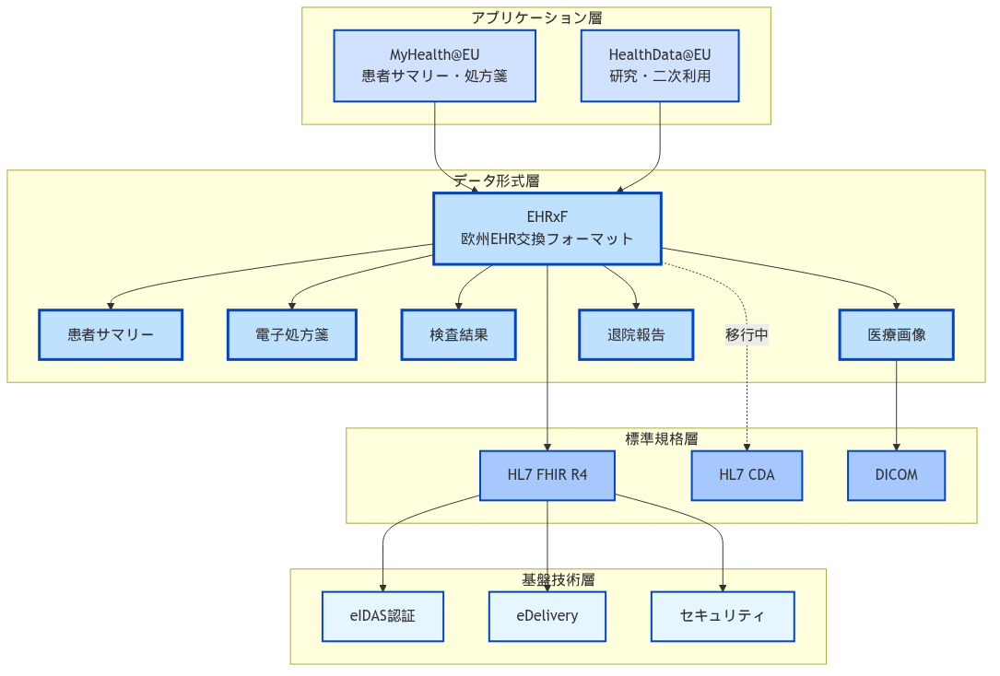

## インフラストラクチャ設計

EHDSの技術基盤は、分散型とフェデレーション型のハイブリッドアーキテクチャを採用している。

### コア技術コンポーネント

#### MyHealth@EU（一次利用基盤）

::: {.fact}
**事実**：MyHealth@EU（旧称eHealth Digital Service Infrastructure）は、電子処方箋と患者サマリーの越境交換サービスを提供する欧州委員会の基幹インフラである。2025年4月時点で全EU加盟国に開放されており、フェデレーション型アーキテクチャを通じて各国のNational Contact Point for eHealth（NCPeH）を接続している[@MyHealthEU2025]。
:::

**確認された技術要素**：

| 項目 | 内容 | 出典 |
|------|------|------|
| アーキテクチャ | フェデレーション型（各国のNational Contact Point for eHealth - NCPeHを接続） | [@MyHealthEU2025] |
| データ交換プロトコル | eDelivery AS4（2025年Release 3より導入） | 欧州委員会発表（2025年3月） |
| 認証基盤 | eIDAS規則に基づく電子認証 | [@eIDAS2025] |
| データ形式 | HL7 FHIR R4（患者サマリー、電子処方箋） | [@HL7Europe2025; @EEHRxF2025] |
| 実装期限 | 2029年：患者サマリー・電子処方箋<br>2031年：医療画像・検査結果・退院報告書 | [@EHDS2025timeline] |

::: {.callout-note}
**注記**：具体的な性能要件（応答時間、可用性SLA等）や暗号化仕様の詳細は、公開されている技術文書では確認できていない。実装においては各国の技術要件に従うものと考えられる。
:::

#### HealthData@EU（二次利用基盤）

::: {.fact}
**事実**：HealthData@EU中央プラットフォームRelease 3は、DG SANTEから初めてオープンソースとして2025年3月26日に公開された。モジュール型アーキテクチャを採用し、各プロジェクトが独立してデプロイ可能な設計となっており、加盟国が再利用可能なビルディングブロックとして活用できる[@HealthDataEU2025]。2027年の本格運用開始を目指し、現在受け入れ環境で開発版が利用可能である。
:::

**EHDS規則で定められた二次利用の目的**[@EC2025impact]：

- 研究活動（科学研究、応用研究）
- イノベーション活動（AI開発、医療機器開発等）
- 政策立案（公衆衛生、医療システム改善）
- 規制活動（医薬品・医療機器の市販後調査等）
- 教育活動（医療従事者の訓練）

## 相互運用性フレームワーク

### EHDSの技術スタック階層

EHDSの相互運用性は、複数の標準規格を階層的に組み合わせて実現されている。

{width=100%}

### EHRxFとFHIRの関係

::: {.fact}
**事実**：欧州電子健康記録交換フォーマット（EHRxF）は、HL7 FHIR R4を基盤として構築されており、従来のCDA（Clinical Document Architecture）からFHIRへの移行が進行中である。2025年5月28日、HL7 EuropeはEHDS向けの4つのFHIR実装ガイドのパブリックレビューを開始した[@HL7Europe2025]。
:::

**技術的な位置づけ**：

| 要素 | 役割 | 実装状況 |
|------|------|----------|
| **EHRxF** | 欧州統一のデータ交換フォーマット仕様 | 6つの優先カテゴリーを定義 |
| **FHIR** | EHRxFの技術的基盤となる国際標準 | R4バージョンを採用 |
| **実装ガイド** | 各データカテゴリー別の具体的実装方法 | 順次策定・公開中 |

### HL7 FHIR標準の採用

#### FHIRとは

**HL7 FHIR（Fast Healthcare Interoperability Resources）**は、医療情報の電子的な交換のための次世代標準規格である[@HL7FHIR2023]。RESTful APIベースのリソース指向アーキテクチャを採用し、現代的なWeb技術（JSON、XML、HTTP）を活用することで、従来の医療情報標準よりも実装が容易になっている。

**技術的特徴**[@HL7FHIR2023]：

- **RESTful設計**: REST成熟度モデルのLevel 2準拠、Level 3拡張可能
- **データ形式**: JSON、XML、RDFをサポート
- **リソース構造**: モジュール型の再利用可能コンポーネント
- **拡張機能**: Extensionメカニズムによる柔軟なカスタマイズ

#### EHDSにおけるFHIR採用の背景

::: {.fact}
**事実**：eHealth Network（eHN）は、検査レポート等のガイドライン実装のためにHL7 FHIR標準を選択した。現在のMyHealth@EUインフラはHL7標準に基づいており、今後はFHIR標準に基づいてサービスを拡張する[@HL7Europe2025]。
:::

**FHIRが選ばれた主な要因**：

1. **柔軟性と適応性**：リアルタイムの臨床データ交換、エクステンションを通じたカスタマイズが可能
2. **越境医療のサポート**：既存のMyHealth@EUインフラとの互換性
3. **実装ガイドの開発**：HL7 EuropeがEHDS優先カテゴリー向けの実装ガイドを策定

::: {.callout-note}
**注記**：EEHRxF（European Electronic Health Record Exchange Format）は現在CDAからFHIRへの移行が進行中であり、2029年までに完全移行が目指されている。
:::

| 従来標準 | 課題 | FHIRの利点 |
|----------|------|------------|
| HL7 v2 | パイプ区切りテキスト、カスタム実装が必要 | RESTful API、標準的なWeb技術 |
| HL7 v3/CDA | XML文書形式、高い複雑性 | モジュール型リソース、段階的実装可能 |
| 各国独自規格 | 相互運用性の欠如 | 国際標準、拡張機能による柔軟性 |

::: {.fact}
**事実**：EHDSは2025年3月の規則施行により、28加盟国間での標準化された健康データ交換を実現するためHL7 FHIR標準を採用。10年間で10.8億ユーロ（一次利用5.4億ユーロ、二次利用5.4億ユーロ）の経済効果が見込まれている[@EC2025impact]。
:::

#### 欧州と日本のFHIR実装アプローチ

::: {.fact}
**事実**：FHIRは欧州で規制主導により採用が進む一方、日本では日本医療情報学会（JAMI）NeXEHRS研究会主導でJP Core（HOTコード、YJコード対応）として独自拡張されている[@JPCore2023]。
:::

| 観点 | 欧州（EHDS） | 日本（JP Core） |
|------|--------------|-----------------|
| アプローチ | 規制主導（トップダウン） | コミュニティ主導（ボトムアップ） |
| 標準化範囲 | EU全域統一 | 国内医療制度に特化 |
| コード体系 | SNOMED CT、LOINC、ICD-11 | HOTコード、YJコード、MEDIS |
| 実装時期 | 2029年から段階的義務化 | 任意採用、段階的普及 |
| バージョン | R4（安定版）、R5（移行準備） | R4ベース（v1.2.0） |
| プロファイル数 | 優先6カテゴリー | 8薬剤プロファイル+23拡張 |

#### FHIRリソースの活用

::: {.callout-note}
**FHIRリソースについて**：EHDSでは、HL7 FHIR標準に基づいた実装ガイドが策定されている。2025年5月にHL7 EuropeがEHDS向けの4つのFHIR実装ガイドのパブリックレビューを開始した[@HL7Europe2025]。実装例については、HL7 International Patient Summary (IPS) Implementation Guide v1.1.0に準拠した公式サンプルが提供されている[@HL7IPS2023]。
:::

```{mermaid}
%%| fig-cap: "EHDS優先カテゴリーとFHIR実装ガイドの関係"
%%{init: {'theme':'base', 'themeVariables': {'primaryColor':'#0f62fe','primaryTextColor':'#161616','primaryBorderColor':'#8d8d8d','lineColor':'#525252','background':'#ffffff'}}}%%
graph TB
    subgraph "HL7 Europe FHIR実装ガイド（2025年5月公開）"
        IG1["Base and Core FHIR IG (R4)"]
        IG2["Base and Core FHIR IG (R5)"]
        IG3["Imaging Study Report FHIR IG"]
        IG4["Extensions FHIR IG"]
    end
    
    subgraph "第1グループ（2029年3月適用）"
        PS["患者サマリー<br/>Patient Summary"]
        EP["電子処方箋<br/>ePrescription"]
        ED["電子調剤記録<br/>eDispensation"]
    end
    
    subgraph "第2グループ（2031年3月適用）"
        MI["医療画像・レポート<br/>Medical Imaging"]
        LR["検査結果<br/>Laboratory Results"]
        DR["退院報告書<br/>Discharge Reports"]
    end
    
    IG1 --> PS
    IG1 --> EP
    IG1 --> ED
    IG2 --> PS
    IG2 --> EP
    IG2 --> ED
    IG3 --> MI
    IG1 --> LR
    IG1 --> DR
    IG2 --> LR
    IG2 --> DR
    
    classDef guide fill:#e5f6ff,stroke:#0072c3,stroke-width:2px,color:#161616
    classDef group1 fill:#d0e2ff,stroke:#0043ce,stroke-width:2px,color:#161616
    classDef group2 fill:#bee1ff,stroke:#0043ce,stroke-width:2px,color:#161616
    
    class IG1,IG2,IG3,IG4 guide
    class PS,EP,ED group1
    class MI,LR,DR group2
```

各優先カテゴリーに対応したFHIRリソース定義が含まれており、具体的なリソースの必須/オプション要件は各実装ガイドで詳細に定義される。

#### FHIR R4とR5の実装戦略

::: {.fact}
**事実**：HL7 EuropeはFHIR R4（2019年の安定版）とR5（最新版）の両方で実装ガイドを開発している。これは組織の技術的成熟度に応じた段階的移行を支援するためである[@HL7Europe2025]。
:::

**バージョン選択の考慮事項**：

| 項目 | FHIR R4 | FHIR R5 | 推奨シナリオ |
|------|---------|---------|-------------|
| 安定性 | Normative（正規版） | Standard for Trial Use | 本番環境はR4 |
| 採用率 | 広く実装済み | 限定的 | 既存システムはR4維持 |
| 機能 | コア機能完備 | 拡張機能追加 | 新規開発はR5検討 |
| 移行パス | - | R4Bブリッジ版経由 | 段階的移行推奨 |

**R4Bブリッジ版の役割**：
- R4の安定性を維持しながらR5機能を選択的に利用
- 完全なR5移行前の過渡期ソリューション
- リスクを最小化しながら新機能を段階的に採用

#### FHIRプロファイリングの実践

##### プロファイリングとは何か

**初心者向け説明**：
FHIRプロファイリングは、標準的な医療データ形式（FHIRリソース）を、特定の国や医療機関の要件に合わせてカスタマイズする仕組みです。例えるなら、「標準的な申請書フォーマット」を「日本の病院用申請書」に調整するようなものです。

**プロファイルの基本概念**：

- **標準FHIRリソース**：世界共通の基本的なデータ構造（例：患者情報の基本形）
- **プロファイル**：その基本形に対して「この項目は必須」「この項目は使わない」などのルールを追加したもの
- **相互運用性の維持**：カスタマイズしても、他のシステムとデータ交換できる互換性を保つ

**なぜプロファイリングが必要か**：

1. **各国の医療制度の違い**：保険番号の形式、診療報酬の仕組みなどが国ごとに異なる
2. **法規制の要件**：個人情報保護法、医療法などの国内法への対応
3. **既存システムとの統合**：各国で既に運用されているシステムとの連携

##### 制約の種類と適用例

```json
// 例：EHDS患者プロファイル（簡略版）
{
  "resourceType": "StructureDefinition",  // これがプロファイル定義であることを示す
  "id": "ehds-patient",                    // このプロファイルのID
  "url": "http://ehds.eu/fhir/StructureDefinition/Patient",  // 一意のURL
  "type": "Patient",                       // カスタマイズ対象のリソースタイプ
  "derivation": "constraint",              // 制約を追加する形式
  "differential": {                        // 標準からの差分を定義
    "element": [
      {
        "id": "Patient.identifier",
        "min": 1,  // 識別子を必須化（標準では任意）
        "max": "*" // 複数の識別子を許可
      },
      {
        "id": "Patient.name",
        "min": 1,  // 氏名を必須化（標準では任意）
        "max": "*" // 複数の名前（旧姓など）を許可
      },
      {
        "id": "Patient.birthDate",
        "min": 1   // 生年月日を必須化（標準では任意）
      }
    ]
  }
}
```

**上記のコードが意味すること**：

- EHDSでは患者データに「識別子」「氏名」「生年月日」が必ず含まれていなければならない
- 標準FHIRではこれらは任意項目だが、EHDSプロファイルでは必須に変更
- 識別子や氏名は複数持つことができる（例：パスポート番号と保険証番号、旧姓と現在の姓）

**カーディナリティ（出現回数）の読み方**：

- `0..1`: 任意で1つまで（あってもなくてもよいが、最大1つ）
- `1..1`: 必ず1つ（省略不可、複数不可）
- `0..*`: 任意で複数可（なくてもよいし、いくつあってもよい）
- `1..*`: 必ず1つ以上（最低1つは必須、複数可）

**実際の適用例**：

- **患者ID**：`1..*`（最低1つの識別子が必要、複数の識別方法を許可）
- **アレルギー情報**：`0..*`（アレルギーがない人もいるため任意、複数記録可）
- **生年月日**：`1..1`（必ず1つ、複数の誕生日はありえない）

::: {.callout-important}
**プロファイル設計の重要なポイント**：
各国でプロファイルを作る際は、「必須項目を増やしすぎない」ことが大切です。必須項目が多すぎると、他の国のシステムとデータ交換ができなくなってしまいます。本当に必要な項目だけを必須にして、その他は任意項目として柔軟に対応できるようにすることが、国際的な相互運用性を実現する鍵となります。
:::

### European EHR Exchange Format (EEHRxF)

::: {.fact}
**事実**：EEHRxF（European Electronic Health Record Exchange Format）は、EU全域での健康データを標準的な欧州フォーマットで表示・交換するための仕様である。EHDS規則の一部として、相互運用性を確保するための共通フォーマットを提供する[@EHDS2025official]。
:::

#### EEHRxFとEHDSの関係

**EEHRxFの役割**：

- EHDSの技術的基盤として、健康データの標準フォーマットを定義
- HL7 FHIR R4を基盤とした欧州共通の実装仕様
- 各国の異なるEHRシステム間でのデータ交換を可能にする

**EHDSで交換される6つの優先データカテゴリー**[@EHDS2025timeline]：

EHDSの実装において、以下のデータカテゴリーが段階的に導入される：

**第1グループ（2029年3月までに実装）**：

1. 患者サマリー（Patient Summary）
2. 電子処方箋（ePrescriptions）  
3. 電子調剤記録（eDispensations）

**第2グループ（2031年3月までに実装）**：

4. 医療画像・レポート（Medical Images and Reports）
5. 検査結果（Laboratory Results）
6. 退院報告書（Discharge Reports）

::: {.callout-important}
**重要な区別**：

- **EHDS**：欧州健康データ空間全体の規制枠組み
- **EEHRxF**：EHDSで使用される技術的なデータフォーマット仕様
- 上記のスケジュールはEHDS全体の実装計画であり、EEHRxFはその技術基盤として機能する
:::

### 用語・コード体系の標準化

::: {.fact}
**事実**：2022年のTEHDAS Joint Action調査によると、EU加盟国で最も使用されている標準は、セマンティック相互運用性においてICD-10とSNOMED CTであり、データ交換においてはHL7 FHIRが最も使用されている。ただし、全体的な状況は不均一であり、将来の規制に完全に準拠する準備ができている加盟国はまだない[@TEHDAS2022]。
:::

::: {.callout-note}
**注記**：EHDS規則では用語体系の標準化が相互運用性の鍵となるが、具体的な技術要件は2027年3月までに採択される実施法令で詳細が定められる予定である。現時点では以下の用語体系が欧州で広く使用されている。
:::

| 用語体系 | 用途 | EU採用状況 | 日本での対応 |
|----------|------|------------|-------------|
| SNOMED CT | 臨床用語 | 広く使用（一部加盟国） | 研究段階（日本標準病名マスターとのマッピング研究）[@SNOMEDCT2008] |
| LOINC | 検査項目 | 広く使用 | JLAC10/JLAC11独自コード体系を使用[@JLAC2024] |
| ICD-10/ICD-11 | 診断分類 | 21ヵ国で使用 | ICD-10使用中、ICD-11移行計画中[@ICD11Japan2025] |
| ATC | 医薬品分類 | 推奨 | KEGGで対応、HOT/YJコード併用[@HOTCODE2003] |
| UCUM | 単位 | 標準化進行中 | JP Core FHIRで採用済み[@JPCore2023] |

::: {.callout-warning}
**専門家による確認推奨**：用語・コード体系の標準化は各国の医療制度と密接に関連する複雑な領域です。実装に際しては、医療情報標準化の専門家や各用語体系の認定専門家によるアドバイスを受けることを強く推奨します。特に、国際標準と国内標準のマッピングや相互運用性の確保には、専門的知識が不可欠です。
:::

### 日欧の医療データ基盤アーキテクチャ比較

```{mermaid}
%%| fig-cap: "日本と欧州の医療データ基盤技術スタック比較"
%%{init: {'theme':'base', 'themeVariables': {'primaryColor':'#0f62fe','primaryTextColor':'#161616','primaryBorderColor':'#8d8d8d','lineColor':'#525252','background':'#ffffff'}}}%%
graph LR
    subgraph "欧州（EHDS）"
        EU_APP["MyHealth@EU<br/>HealthData@EU"]
        EU_FORMAT["EHRxF"]
        EU_STD["HL7 FHIR R4<br/>（統一実装）"]
        EU_TERM["SNOMED CT<br/>LOINC<br/>ICD-11"]
        EU_AUTH["eIDAS"]
        
        EU_APP --> EU_FORMAT
        EU_FORMAT --> EU_STD
        EU_STD --> EU_TERM
        EU_STD --> EU_AUTH
    end
    
    subgraph "日本"
        JP_APP["電子カルテ情報<br/>共有サービス"]
        JP_FORMAT["SS-MIX2<br/>（移行中）"]
        JP_STD["HL7 FHIR JP Core<br/>（独自拡張）"]
        JP_TERM["MEDIS標準<br/>HOTコード<br/>YJコード"]
        JP_AUTH["マイナンバー<br/>HPKI"]
        
        JP_APP --> JP_FORMAT
        JP_FORMAT --> JP_STD
        JP_STD --> JP_TERM
        JP_STD --> JP_AUTH
    end
    
    EU_STD <-.->|相互運用性の課題| JP_STD
    
    classDef euStyle fill:#d0e2ff,stroke:#0043ce,stroke-width:2px,color:#161616
    classDef jpStyle fill:#a6c8ff,stroke:#0043ce,stroke-width:2px,color:#161616
    
    class EU_APP,EU_FORMAT,EU_STD,EU_TERM,EU_AUTH euStyle
    class JP_APP,JP_FORMAT,JP_STD,JP_TERM,JP_AUTH jpStyle
```

::: {.callout-note}
**技術的相違点**：

- **データフォーマット**：欧州はEHRxFで統一、日本はSS-MIX2からFHIRへ移行中
- **FHIR実装**：欧州は統一実装、日本はJP Core独自拡張
- **用語体系**：欧州は国際標準採用、日本は国内標準を維持
- **認証基盤**：欧州はeIDAS、日本はマイナンバー/HPKI
:::

### 日欧相互運用性の技術的課題と解決アプローチ

::: {.fact}
**事実**：日本と欧州のFHIR実装の違いは、主に用語体系（日本：HOT/YJコード、欧州：SNOMED CT/LOINC）とガバナンスモデル（日本：ボトムアップ、欧州：トップダウン）に起因する[@JPCore2023; @EC2025impact]。2024年の研究では、日本のJP Coreは8つの薬剤関連プロファイルと23の拡張を含み、HOTコードやYJコードなどの日本独自の用語体系を採用しているため、国際標準との相互運用性に課題があることが指摘されている[@JPMedFHIR2024]。
:::

::: {.callout-warning}
**相互運用性への影響度**：
日欧のFHIR実装の違いは「多少の亜種」ではなく、**実質的な相互運用性の障壁**となっています。主な影響：

1. **用語マッピングの複雑性**：HOTコード（約17,000品目）からATC分類への変換には、1対多の対応関係があり自動変換が困難
2. **データ交換の制約**：処方箋の越境交換では、用法用量の表現方法の違いにより再入力が必要
3. **実装コスト**：変換ゲートウェイの開発・運用に年間数千万円規模の投資が必要と推定

ただし、これは克服不可能な問題ではなく、段階的なアプローチ（IPS準拠、用語マッピングテーブルの構築、変換APIの開発）により解決可能です[@JPMedFHIR2024]。
:::

#### 主要な相互運用性の課題

| 課題領域 | 具体的問題 | 影響度 | 解決アプローチ |
|----------|------------|--------|----------------|
| **用語マッピング** | HOT⇔ATC、MEDIS⇔SNOMED CT | 高 | 変換テーブル構築、AI支援マッピング |
| **プロファイル差異** | 必須要素の相違、拡張機能の非互換 | 中 | 共通コアプロファイル策定 |
| **識別子体系** | マイナンバー⇔eIDAS | 高 | フェデレーション型ID連携 |
| **データモデル** | SS-MIX2⇔FHIR移行状況の差 | 中 | 段階的移行、変換ゲートウェイ |

#### 技術的解決策

日欧間の相互運用性を実現するため、以下の複数のアプローチが考えられる：

#### アプローチ1: ゲートウェイ方式（Federated Gateway）

##### 用語マッピングサービス

**技術的アーキテクチャ**[@JPMedFHIR2024]：

用語マッピングサービスは、以下の3つの主要な変換機能を提供する：

- **薬剤コード変換**：HOTコードからATCコードへのセマンティックマッピング
- **薬価コード変換**：YJコードからRxNormへの直接マッピング
- **病名変換**：日本標準病名からSNOMED CTへのハイブリッドマッピング

::: {.callout-note}
**マッピングの課題**：日本のJP Core研究では、HOTコードやYJコードなどの日本独自用語体系から国際標準への変換において、一対多の対応関係や概念の不一致により完全自動化が困難であることが報告されている[@JPMedFHIR2024]。実用化には専門家による検証と段階的なマッピングテーブルの構築が必要である。
:::

**技術的仕組みの詳細**：

用語マッピングサービスは、日本の医療用語体系（HOTコード、YJコード等）と欧州の国際標準（ATC、SNOMED CT等）を相互変換する核となる技術である[@JPMedFHIR2024]。

**マッピング処理の流れ**：

1. **入力データの解析**：日本のFHIRリソースからHOTコード等を抽出
2. **セマンティック変換**：機械学習とルールベースのハイブリッド手法でATCコードに変換
3. **品質評価**：変換結果の適切性を複数の手法で検証
4. **専門家レビュー**：自動変換が困難な場合は専門家による確認
5. **FHIR出力**：欧州標準準拠のFHIRリソースとして出力

**コア技術要素**：

- **自然言語処理（NLP）**：薬剤名の意味的類似性を計算
- **オントロジーマッピング**：概念体系間の関係性を定義
- **機械学習**：過去のマッピング履歴から最適解を学習
- **ルールエンジン**：専門家知識をルール化して適用

#### アプローチ2: 共通プロファイル方式（Common Profile Layer）

::: {.callout-note}
**IPSとは**：International Patient Summary（国際患者サマリー）は、計画外の国境を越えた医療において必要な最小限かつ必須の健康情報を含むHL7 FHIR文書である。ISO 27269およびEN 17269で規定され、アレルギー、服薬歴、既往歴を必須項目とし、専門分野に依存しない汎用的なデータセットとして設計されている[@IPS2024]。
:::

**IPS共通レイヤーのアプローチ**：

- **基盤技術**：HL7 FHIR R4ベースのIPS実装ガイド（STU 1.1.0）を活用
- **共通要素の抽出**：
  - 必須項目：アレルギー・不耐性、服薬歴、既往歴
  - 推奨項目：免疫歴、医療機器、診断画像結果
  - 任意項目：バイタルサイン、検査結果、治療計画
- **地域拡張の管理**：IPS拡張メカニズムで各国特有項目に対応
- **変換プロセス**：
  1. 各国プロファイル → IPS共通形式への変換
  2. IPS共通形式 → 宛先国プロファイルへの変換
  3. 用語マッピング（SNOMED CT、LOINC等の国際標準経由）

**IPSベースの共通形式例**：

IPS共通プロファイルでは、患者の最重要な医療情報を構造化されたFHIR Bundle形式で表現する：

- **Bundle**: 複数のFHIRリソースをまとめて送信するためのコンテナ
- **Composition**: 文書全体の構造と目次を定義するリソース
- **必須セクション**: アレルギー・服薬歴・既往歴の3つが国際的に必須
- **任意セクション**: バイタルサイン・検査結果・医療機器等を追加可能

この共通形式により、日本のJP Core FHIRから欧州のEU Base FHIRへの変換が標準化される。

**利点**：

- 標準化された共通インターフェース、維持コストの削減
- 既存の国際標準に準拠、グローバルな相互運用性
- 段階的実装が可能（必須項目から開始）

**欠点**：

- 各地域の特殊要件への対応が制限される
- 既存システムの大幅な改修が必要な場合がある
- IPSの必須項目が各国で未実装の場合、データ欠損が発生

#### アプローチ3: 分散型標準化方式（Distributed Standardization）

**アーキテクチャの概要**：

単一障害点を排除し、各国が対等なノードとして、標準化されたプロトコルで直接接続する分散アーキテクチャである。

**主要コンポーネント**：

- **各国ノード**：自国のデータを保持し、標準化APIを提供
- **共通標準プロトコル**：IPS + FHIR R5による統一された交換仕様
- **P2Pネットワーク**：各国が必要に応じて直接接続

**データ交換の流れ**：

1. 要求元が対象国に直接アクセス申請
2. 対象国が自国の規制に基づき承認
3. 標準化されたAPIで直接データ交換
4. 各国がアクセスログを分散管理

**利点**：

- 単一障害点の完全排除
- 無限のスケーラビリティ
- 各国のデータ主権の完全保護
- 運用コストの分散化

**欠点**：

- 初期の標準化調整が複雑
- 各国での実装品質のばらつき
- ネットワーク効果が出るまで時間が必要


#### 推奨実装戦略

現実的な実装戦略として、3つの相互運用性アプローチから適切な組み合わせを選択することを推奨する：

| アプローチ | 適用シナリオ | 主な利点 | 主な課題 |
|------------|--------------|----------|----------|
| **ゲートウェイ方式** | 短期PoC、限定的な接続 | 実装が容易、既存システム影響小 | 運用コスト、拡張性の限界 |
| **共通プロファイル方式** | 標準化重視、段階的移行 | 国際標準準拠、維持コスト低 | システム改修、機能制約 |
| **分散型標準化方式** | 長期的な完全相互運用 | SPOF排除、無限の拡張性 | 初期調整の複雑性 |

**段階的実装の推奨**：

1. **短期（2025-2027）**：ゲートウェイ方式でPoC実装
2. **中期（2027-2030）**：共通プロファイル方式への移行
3. **長期（2030年以降）**：分散型標準化方式による完全相互運用

#### 短期実装例：ゲートウェイ方式アーキテクチャ

短期フェーズで実装するゲートウェイ方式の具体的なアーキテクチャを以下に示す：

```{mermaid}
%%| fig-cap: "日欧間相互運用性ゲートウェイアーキテクチャ"
%%{init: {'theme':'base', 'themeVariables': {'primaryColor':'#0f62fe','primaryTextColor':'#161616','primaryBorderColor':'#8d8d8d','lineColor':'#525252','background':'#ffffff'}}}%%
graph LR
    subgraph "日本"
        JP_FHIR["JP Core FHIR Server"]
        JP_MAP["用語マッピング"]
        JP_AUTH["マイナンバー認証"]
    end
    
    subgraph "ゲートウェイ層"
        GW["相互運用性ゲートウェイ"]
        TRANS["プロファイル変換"]
        TERM["用語変換"]
    end
    
    subgraph "欧州"
        EU_FHIR["EHDS FHIR Server"]
        EU_MAP["SNOMED/LOINC"]
        EU_AUTH["eIDAS認証"]
    end
    
    JP_FHIR <--> JP_MAP
    JP_MAP <--> GW
    GW <--> TRANS
    GW <--> TERM
    GW <--> EU_MAP
    EU_MAP <--> EU_FHIR
    
    JP_AUTH -.->|ID連携| EU_AUTH
```

**ゲートウェイによる医療データ相互運用の仕組み**：

このアーキテクチャは、日本と欧州の異なる医療データ標準間で、患者情報を安全に変換・交換するための仕組みである。

**実用的なデータ交換シナリオ**：

**ケース1：緊急医療での患者情報照会**
- 日本人旅行者がドイツで救急搬送された場合
- ドイツの医師が患者の服薬歴・アレルギー情報を照会
- ゲートウェイが日本の電子カルテデータを欧州標準に変換して提供

**ケース2：国際共同研究でのデータ活用**
- 日欧共同での医薬品副作用研究
- 日本の臨床データを欧州の研究プラットフォームで解析
- 用語・単位・プロファイルを統一形式に変換

**主要な変換処理**：

1. **用語変換の具体例**：
   - 薬剤：ロキソニン（HOT9534567）→ Loxoprofen（ATC: M01AE01）
   - 診断：本態性高血圧症（日本標準病名）→ Essential hypertension（SNOMED CT: 59621000）
   - 検査：血糖値（JLAC10: 3F015）→ Glucose（LOINC: 2345-7）

2. **プロファイル変換の具体例**：
   - JP Core：患者ID（マイナンバー）→ EHDS：患者ID（eIDAS識別子）
   - JP Core：用法用量（日本語テキスト）→ EHDS：構造化された投与指示
   - JP Core：検査結果単位（mg/dl）→ EHDS：SI単位（mmol/L）

3. **データ構造変換の具体例**：
   ```json
   // 変換前（JP Core）
   {
     "resourceType": "MedicationRequest",
     "medicationCodeableConcept": {
       "coding": [{"system": "urn:oid:1.2.392.100495.20.2.74", "code": "HOT9534567"}]
     }
   }
   
   // 変換後（EHDS準拠）
   {
     "resourceType": "MedicationRequest", 
     "medicationCodeableConcept": {
       "coding": [{"system": "http://www.whocc.no/atc", "code": "M01AE01"}]
     }
   }
   ```

**変換品質の保証**：

- **医師による確認**：自動変換困難な用語は専門医が検証
- **変換履歴の記録**：どの日本語用語がどの国際標準に変換されたかを記録
- **信頼度スコア**：各変換結果に95%、85%等の信頼度を付与
- **エラーハンドリング**：変換不可能な項目は「情報不足」として明示

#### 中期実装例：共通プロファイル方式（IPS）アーキテクチャ

中期フェーズでは、International Patient Summary（IPS）を共通仲介層として活用する標準化アプローチを実装する：

```{mermaid}
%%| fig-cap: "IPS共通プロファイル方式による日欧相互運用性"
%%{init: {'theme':'base', 'themeVariables': {'primaryColor':'#0f62fe','primaryTextColor':'#161616','primaryBorderColor':'#8d8d8d','lineColor':'#525252','background':'#ffffff'}}}%%
graph TB
    subgraph "日本側システム"
        JP_EHR["電子カルテシステム"]
        JP_CORE["JP Core FHIR"]
    end
    
    subgraph "共通標準レイヤー"
        IPS["International Patient Summary<br/>（ISO 27269準拠）"]
        SNOMED["SNOMED CT"]
        LOINC["LOINC"]
        ICD11["ICD-11"]
    end
    
    subgraph "欧州側システム"
        EU_CORE["EU Base FHIR"]
        EU_EHR["EHDS準拠システム"]
    end
    
    JP_EHR --> JP_CORE
    JP_CORE --> IPS
    IPS --> SNOMED
    IPS --> LOINC
    IPS --> ICD11
    SNOMED --> EU_CORE
    LOINC --> EU_CORE
    ICD11 --> EU_CORE
    EU_CORE --> EU_EHR
```

**IPS共通プロファイル方式の特徴**：

1. **標準化された変換プロセス**：
   - 段階1：JP Core → IPS変換（日本独自要素を国際標準要素にマッピング）
   - 段階2：IPS → EU Base変換（国際標準から欧州仕様へ適応）

2. **必須データ要素の統一**：
   - アレルギー・不耐性情報（AllergyIntolerance）
   - 服薬歴（MedicationSummary）
   - 既往歴・現病歴（ProblemList）

3. **実用的な変換例**：
   ```json
   // JP Core → IPS変換
   {
     "resourceType": "AllergyIntolerance",
     "code": {
       "coding": [
         {
           "system": "http://jpfhir.jp/fhir/core/CodeSystem/JP_AllergyIntolerance_VS",
           "code": "PENICILLIN_ALLERGY_JP"
         }
       ]
     }
   }
   
   // IPS標準形式
   {
     "resourceType": "AllergyIntolerance", 
     "code": {
       "coding": [
         {
           "system": "http://snomed.info/sct",
           "code": "294505008",
           "display": "Allergy to penicillin"
         }
       ]
     }
   }
   ```

#### 長期実装例：分散型標準化アーキテクチャ

長期フェーズでは、単一障害点を排除し、各国のデータ主権を完全に保護しながら、標準化されたプロトコルによる完全な相互運用性を実現する：

```{mermaid}
%%| fig-cap: "分散型メッシュ相互運用アーキテクチャ"
%%{init: {'theme':'base', 'themeVariables': {'primaryColor':'#0f62fe','primaryTextColor':'#161616','primaryBorderColor':'#8d8d8d','lineColor':'#525252','background':'#ffffff'}}}%%
graph LR
    subgraph "日本"
        JP_NODE["日本医療データノード"]
        JP_API["標準化API Gateway"]
        JP_IPS["IPS準拠変換"]
    end
    
    subgraph "ドイツ"
        DE_NODE["ドイツ医療データノード"]
        DE_API["標準化API Gateway"]
        DE_IPS["IPS準拠変換"]
    end
    
    subgraph "フランス"
        FR_NODE["フランス医療データノード"]
        FR_API["標準化API Gateway"]
        FR_IPS["IPS準拠変換"]
    end
    
    subgraph "英国"
        UK_NODE["英国医療データノード"]
        UK_API["標準化API Gateway"]
        UK_IPS["IPS準拠変換"]
    end
    
    subgraph "共通標準レイヤー"
        STD["IPS + FHIR R5"]
        TERM["国際用語標準"]
        SEC["分散認証・暗号化"]
    end
    
    JP_NODE --> JP_API
    JP_API --> JP_IPS
    DE_NODE --> DE_API
    DE_API --> DE_IPS
    FR_NODE --> FR_API
    FR_API --> FR_IPS
    UK_NODE --> UK_API
    UK_API --> UK_IPS
    
    JP_IPS <--> STD
    DE_IPS <--> STD
    FR_IPS <--> STD
    UK_IPS <--> STD
    
    STD <--> TERM
    STD <--> SEC
    
    JP_API <-.->|直接P2P| DE_API
    JP_API <-.->|直接P2P| FR_API
    DE_API <-.->|直接P2P| UK_API
    FR_API <-.->|直接P2P| UK_API
```

**分散型標準化方式の特徴**：

1. **完全な分散アーキテクチャ**：
   - 単一障害点（SPOF）の完全排除
   - 各国のデータ主権の完全保護
   - スケーラブルなP2P接続

2. **標準化による相互運用性**：
   - IPS（International Patient Summary）完全準拠
   - FHIR R5による次世代相互運用性
   - AI支援による自動用語マッピング

3. **実用的なデータ活用シナリオ**：
   - **ケース：リアルタイム緊急医療**
     - 日本人患者がドイツで緊急搬送
     - ドイツ→日本への直接API呼び出し
     - リアルタイムでの患者サマリー取得

   - **ケース：分散型臨床研究**
     - 希少疾患の国際共同研究
     - 各国が自国データを保持したまま参加
     - 標準化されたクエリで統計的分析を実施

   - **ケース：パンデミック対応**
     - 新興感染症の早期警戒システム
     - 各国の疫学データを標準フォーマットで共有
     - 分散合意アルゴリズムによる迅速な意思決定

**技術的な実現要素**：

- **分散ID管理**：各国の認証システムが直接連携
- **エッジコンピューティング**：データ処理を各国内で完結
- **ブロックチェーン監査**：データアクセス履歴の透明性確保
- **AI支援変換**：用語・プロファイル変換の完全自動化

::: {.callout-note}
**段階的発展の重要性**：短期のゲートウェイ方式で基本的な相互運用性を確立し、中期のIPS方式で標準化を進め、長期の分散型方式で持続可能で拡張性のある国際医療データ連携基盤を構築する。この段階的アプローチにより、各段階での学習と改善を重ねながら、最終的に単一障害点のない堅牢なシステムを実現できる。
:::

## セキュリティとプライバシー

### 技術的保護措置

::: {.fact}
**事実**：EHDS規則（EU 2025/327）第50条では、「健康データアクセス機関は、セキュアプロセッシング環境を通じてのみ電子健康データへのアクセスを提供しなければならない」と定めており[@EC2022proposal; @EU2025]、技術的・組織的措置、セキュリティ、相互運用性要件の実装が求められている。詳細な技術仕様は2027年3月までに採択される実施法令で規定される予定である。
:::

#### EHDS実装の参考となるセキュリティアプローチ

::: {.callout-warning}
**注意**：以下のセキュリティ技術は、ENISA（欧州サイバーセキュリティ庁）のデータ保護エンジニアリングガイドライン[@ENISA2022]および医療データ保護における国際的なベストプラクティスに基づく推奨事項である。EHDS規則の具体的な技術仕様は2027年3月までに採択される実施法令で定められる予定であり、実装時は最新の公式仕様を確認すること。
:::

**1. データ暗号化要件**

ENISAのデータ保護エンジニアリング報告書によると、医療データの保護において以下の暗号化アプローチが推奨される[@ENISA2022]：

- **保存時暗号化**：
  - 強力な暗号化アルゴリズムの使用（AES-256等）
  - ファイルシステムレベル、データベースレベル、アプリケーションレベルでの暗号化オプション（セクション5.2）[@ENISA2022]
  
- **転送時暗号化**：
  - TLS 1.2以上の使用（TLS 1.3を強く推奨）
  - エンドツーエンド暗号化（E2EE）の実装検討（セクション5.1.1）[@ENISA2022]
  
- **鍵管理**：
  - 暗号鍵の安全な生成、保管、ローテーション
  - HSM（Hardware Security Module）の活用を推奨
  
- **暗号化アルゴリズム**：
  - 各国のサイバーセキュリティ機関が承認したアルゴリズムの使用

**2. アイデンティティ・アクセス管理（IAM）**

ISO/IEC 27001およびOWASP（Open Web Application Security Project）のガイドラインに基づき、以下のIAM実装が推奨される[@ISO27001_2022; @OWASP2024]：

- **認証方式の強化**：
  - 多要素認証（MFA）の実装
  - 生体認証技術の活用検討
  - リスクベース認証の導入
  
- **認可フレームワーク**：
  - OAuth 2.0およびOpenID Connectなどの標準プロトコル[@RFC6749; @OIDC2014]
  - 患者による同意管理機能
  - 役割ベースアクセス制御（RBAC）

**3. ネットワークセキュリティ**

NIST Special Publication 800-207「ゼロトラストアーキテクチャ」に基づく実装が推奨される[@NIST2020ZTA]：

- **ゼロトラストの原則**：
  - 「決して信頼せず、常に検証する」アプローチ
  - ネットワークセグメンテーション
  - 継続的な信頼性評価
  
- **ネットワーク保護**：
  - 医療データゾーンの分離
  - ファイアウォールによる多層防御
  - VPN等による安全な接続

**4. 監査・コンプライアンス**

ISO/IEC 27018（クラウドにおける個人情報保護）およびGDPR第32条の技術的措置に準拠[@ISO27018_2019; @GDPR2016]：

- **ロギング要件**：
  - データアクセスの包括的な記録
  - ログの完全性と改ざん防止
  - 規制要件に応じた保存期間
  
- **監査機能**：
  - 監査ログの定期的レビュー
  - セキュリティ情報イベント管理（SIEM）の活用
  - 異常検知とアラート機能

**5. データ保護・プライバシー**

ISO/IEC 20889（プライバシー強化のためのデ・アイデンティフィケーション技術）に基づく実装[@ISO20889_2018]：

- **仮名化・匿名化**：
  - データの再識別リスクを最小化する技術の適用
  - k-匿名性などのプライバシー保護手法[@Sweeney2002]
  - 差分プライバシーの検討[@Dwork2014]
  
- **データガバナンス**：
  - 目的制限の原則の遵守
  - データ保持ポリシーの策定と実施
  - 不要データの安全な削除手順

**6. インシデント対応**

ISO/IEC 27035（情報セキュリティインシデント管理）に準拠した体制構築[@ISO27035_2023]：

- **監視体制**：
  - セキュリティ監視の実施
  - 脅威インテリジェンスの活用
  - インシデント検知と対応の迅速化
  
- **対応計画**：
  - インシデント対応手順の文書化
  - GDPR等の規制に基づく通知要件（72時間以内）
  - 事業継続計画との統合

**7. セキュリティ評価・認証**

- **推奨される認証**：
  - ISO/IEC 27001（情報セキュリティマネジメント）[@ISO27001_2022]
  - ISO/IEC 27017（クラウドセキュリティ）[@ISO27017_2015]
  - ISO/IEC 27701（プライバシー情報マネジメント）[@ISO27701_2019]
  
- **継続的改善**：
  - 定期的なセキュリティ評価
  - 脆弱性管理プログラム
  - セキュリティ教育と訓練

### プライバシー強化技術（PETs）

::: {.callout-note}
**注記**：EHDSの二次利用において、データ保護の観点から匿名化・仮名化などのデータ最小化措置とセキュアプロセッシング環境での処理が重要な役割を果たすとされている。学術研究では、これらの措置の効果的で一貫性のある実装のために、より明確な規制要件の必要性が指摘されている[@Cambridge2023EHDS]。
:::

#### 医療データ研究で検討されているPETs

```{mermaid}
%%| fig-cap: "医療データの二次利用で活用が検討されているプライバシー強化技術"
%%{init: {'theme':'base', 'themeVariables': {'primaryColor':'#0f62fe','primaryTextColor':'#161616','primaryBorderColor':'#8d8d8d','lineColor':'#525252','background':'#ffffff'}}}%%
graph LR
    subgraph "データ処理段階"
        A[元データ] --> B[匿名化・仮名化]
        B --> C[差分プライバシー]
        C --> D[分析結果]
    end
    
    subgraph "計算手法"
        E[連合学習]
        F[準同型暗号]
        G[セキュアマルチパーティ計算]
    end
    
    B --> E
    B --> F
    B --> G
    E --> D
    F --> D
    G --> D
    
    classDef process fill:#d0e2ff,stroke:#0043ce,stroke-width:2px,color:#161616
    classDef method fill:#a6c8ff,stroke:#0043ce,stroke-width:2px,color:#161616
    
    class A,B,C,D process
    class E,F,G method
```

::: {.callout-note}
**注記**：上記の技術は、医療データのプライバシー保護に関する学術研究や国際的な技術コミュニティで検討されている手法である。実際の実装においては、各国の規制要件と技術的制約を考慮した上で、適切な技術の選択と組み合わせが必要となる。
:::

## クラウドインフラストラクチャ

### 要件と認証

::: {.callout-note}
**注記**：主要クラウドプロバイダー（AWS、Azure、Google Cloud等）は、EHDS要件に対応したクラウドサービスの提供に向けて準備を進めている。各プロバイダーは、EU域内でのデータ保存、GDPR準拠、適切なセキュリティ認証の取得などを通じて、医療データの安全な処理環境を提供することが期待されている。
:::

**クラウドプロバイダー要件**：

1. **データローカライゼーション**
   - EU域内でのデータ保存
   - データレジデンシーの保証
   - 越境転送の制限

2. **セキュリティ認証**
   - ISO 27001/27017/27018
   - SOC 2 Type II
   - CSA STAR Level 2

3. **コンプライアンス**
   - GDPR完全準拠
   - EHDS特有要件への対応
   - 定期的な第三者監査

### ハイブリッドクラウド戦略

::: {.analysis}
**考察**：医療分野では、セキュリティ要件、規制遵守、レガシーシステムとの統合などの課題から、多くの医療機関がハイブリッドクラウド戦略を採用している[@Gartner2023Healthcare]。WHOのデジタルヘルス戦略2020-2025では、各国が既存のハードウェアと接続性の包括的な評価を行い、デジタル化を推進するためのインフラストラクチャのニーズとソリューションを特定すること、そして柔軟なデジタルインフラストラクチャを構築することの重要性が強調されている[@WHO2021Digital]。この文脈において、機密性の高い患者データはオンプレミスで管理しつつ、研究用の匿名化データや災害復旧システムはクラウドを活用するハイブリッド戦略は、各国の状況に応じた現実的なアプローチとして位置づけられる。
:::

**推奨アーキテクチャ**：

- **オンプレミス**：機密性の高い患者データ、レガシーシステム
- **プライベートクラウド**：院内システム、部門システム
- **パブリッククラウド**：匿名化データ、研究用データセット

## API設計とマイクロサービス

### RESTful API設計原則

#### FHIRベースのRESTful API実装

::: {.fact}
**事実**：HL7 FHIRは、RESTful アーキテクチャ原則に基づいて設計された医療データ交換標準であり、EHDSの技術実装において中核的な役割を果たしている[@HL7FHIR2023]。FHIRは、HTTPプロトコルを使用し、リソースベースのアプローチで医療情報を構造化・交換する。
:::

**FHIRのRESTful設計原則**：

1. **リソース指向アーキテクチャ**
   - すべての医療データは「リソース」として表現（Patient、Observation、MedicationRequest等）
   - 各リソースは一意のURL（論理ID）でアクセス可能
   - 標準的なHTTPメソッド（GET、POST、PUT、DELETE）による操作

2. **統一インターフェース**
   ```http
   # 患者情報の取得
   GET /fhir/Patient/123
   Accept: application/fhir+json
   
   # 検査結果の検索
   GET /fhir/Observation?patient=123&code=http://loinc.org|2345-7
   
   # 新規処方の登録
   POST /fhir/MedicationRequest
   Content-Type: application/fhir+json
   ```

3. **ステートレス通信**
   - 各リクエストは独立して処理可能
   - セッション状態をサーバー側で保持しない
   - 認証トークンによる状態管理

**FHIR標準に基づくAPI実装パターン**：

::: {.callout-note}
**注記**：以下の例は、HL7 FHIR仕様書[@HL7FHIR2023]に定義されている標準的なRESTful APIパターンを、EHDS実装の文脈で示したものである。実際の実装では、各国の規制要件やシステム要件に応じた調整が必要となる。
:::

```yaml
# OpenAPI 3.0形式でのFHIR API定義例
openapi: 3.0.0
info:
  title: FHIR API Example for EHDS
  version: 1.0.0
paths:
  /fhir/Patient/{id}:
    get:
      summary: 患者情報取得
      parameters:
        - name: id
          in: path
          required: true
          schema:
            type: string
      security:
        - OAuth2: [patient/Patient.read]
      responses:
        200:
          description: 患者リソース
          content:
            application/fhir+json:
              schema:
                $ref: 'http://hl7.org/fhir/patient.schema.json'
```

**FHIR仕様に定義された検索機能の活用例**：

FHIR仕様書では、リソース検索のための包括的な検索パラメータが定義されている[@HL7FHIR2023]。これらを組み合わせることで、複雑な医療データクエリが可能となる：

```http
# FHIR標準の検索パラメータを使用した例
GET /fhir/Observation?
  patient=123&
  code=http://loinc.org|2345-7&
  date=ge2024-01-01&
  _include=Observation:patient
```

**FHIRトランザクション機能の活用**：

FHIR仕様では、複数のリソース操作を原子的に実行するためのBundleリソースとトランザクション機能が定義されている[@HL7FHIR2023]。これにより、データの一貫性を保ちながら複数の医療記録を更新できる：

```json
{
  "resourceType": "Bundle",
  "type": "transaction",
  "entry": [
    {
      "request": {
        "method": "POST",
        "url": "Patient"
      },
      "resource": {
        "resourceType": "Patient",
        "name": [{"family": "Example"}]
      }
    }
  ]
}
```

### マイクロサービスアーキテクチャ

#### マイクロサービスアーキテクチャの採用

::: {.fact}
**事実**：HealthData@EU Central Platform Release 3（2025年3月公開）の技術仕様では、「中央プラットフォームはモジュール型アーキテクチャを使用しなければならない」と規定され、さらに「中央プラットフォームは、運用の拡張性と柔軟性を確保するためにマイクロサービスを実装しなければならない」と明記されている。このプラットフォームはDG SANTEからオープンソースとして公開され、eDelivery、eTranslation、EU Loginなどの欧州委員会ビルディングブロックを活用している[@HealthDataEU2025]。
:::

::: {.analysis}
**考察**：EHDSは公式にマイクロサービスアーキテクチャを採用しており、この設計により以下の利点が実現される：

1. **独立したデプロイメント**：各モジュールが独立して開発・更新可能
2. **段階的な実装**：2029年、2031年の段階的導入に合わせて必要なモジュールを順次追加
3. **各国の柔軟な実装**：標準化されたインターフェースを維持しながら、各国が独自の実装を選択可能
4. **再利用性の向上**：オープンソースのビルディングブロックとして提供され、各国で再利用可能
:::

#### マイクロサービス構成の検討例

::: {.callout-note}
**注記**：以下は、EHDSの技術要件とマイクロサービスアーキテクチャの一般的な設計パターンに基づいた実装例の一つである。実際の実装は、各国の技術的制約、既存システムとの統合要件、規制要件などに応じて異なる構成となる可能性がある。
:::

```{mermaid}
%%| fig-cap: "マイクロサービスアーキテクチャの構成例"
%%{init: {'theme':'base', 'themeVariables': {'primaryColor':'#0f62fe','primaryTextColor':'#161616','primaryBorderColor':'#8d8d8d','lineColor':'#525252','background':'#ffffff'}}}%%
graph TB
    subgraph "API Gateway層"
        GW["API Gateway<br/>(Kong/Apigee)"]
    end
    
    subgraph "認証・認可層"
        AUTH["Identity Service<br/>(Keycloak/Auth0)"]
        CONSENT["Consent Management"]
    end
    
    subgraph "コアサービス層"
        PATIENT["Patient Service<br/>(FHIR Patient)"]
        CLINICAL["Clinical Service<br/>(FHIR Observation)"]
        MEDICATION["Medication Service<br/>(FHIR MedicationRequest)"]
        IMAGING["Imaging Service<br/>(DICOM/FHIR)"]
    end
    
    subgraph "データ処理層"
        TRANSFORM["Data Transformation<br/>(用語マッピング)"]
        ANALYTICS["Analytics Service<br/>(研究用データ処理)"]
        ANON["Anonymization Service<br/>(仮名化・匿名化)"]
    end
    
    subgraph "インフラ層"
        AUDIT["Audit Service<br/>(監査ログ)"]
        MONITOR["Monitoring<br/>(Prometheus/Grafana)"]
        QUEUE["Message Queue<br/>(Kafka/RabbitMQ)"]
    end
    
    GW --> AUTH
    AUTH --> CONSENT
    GW --> PATIENT
    GW --> CLINICAL
    GW --> MEDICATION
    GW --> IMAGING
    
    PATIENT --> TRANSFORM
    CLINICAL --> TRANSFORM
    MEDICATION --> TRANSFORM
    
    TRANSFORM --> ANALYTICS
    ANALYTICS --> ANON
    
    PATIENT --> QUEUE
    CLINICAL --> QUEUE
    QUEUE --> AUDIT
    
    AUDIT --> MONITOR
    
    classDef gateway fill:#e5f6ff,stroke:#0072c3,stroke-width:2px,color:#161616
    classDef auth fill:#d0e2ff,stroke:#0043ce,stroke-width:2px,color:#161616
    classDef core fill:#bee1ff,stroke:#0043ce,stroke-width:2px,color:#161616
    classDef data fill:#a6c8ff,stroke:#0043ce,stroke-width:2px,color:#161616
    classDef infra fill:#f4f4f4,stroke:#8d8d8d,stroke-width:2px,color:#161616
    
    class GW gateway
    class AUTH,CONSENT auth
    class PATIENT,CLINICAL,MEDICATION,IMAGING core
    class TRANSFORM,ANALYTICS,ANON data
    class AUDIT,MONITOR,QUEUE infra
```

#### 考慮すべきサービス機能の例

| サービスカテゴリ | 想定される機能 | 関連するEHDS要件 | 実装時の考慮点 |
|-----------------|--------------|----------------|--------------|
| **認証・認可** | ID管理、認証、同意管理 | EHDS規則第3条（患者の権利）、eIDAS規則 | 各国の既存認証システムとの統合 |
| **データアクセス** | FHIR APIによる医療データ提供 | 優先6カテゴリーのデータ交換 | EHRxF準拠、HL7 FHIR実装 |
| **データ変換** | 用語・コード体系のマッピング | セマンティック相互運用性 | 各国の医療用語体系への対応 |
| **監査・セキュリティ** | ログ管理、アクセス制御 | GDPR、EHDS第50条 | トレーサビリティの確保 |
| **データ処理** | 研究用データの処理 | 二次利用目的の実現 | プライバシー保護技術の適用 |

::: {.callout-note}
**実装上の注意点**：マイクロサービスアーキテクチャは複雑性が増すため、以下の点に留意する必要がある：

- サービス間通信のオーバーヘッド最小化（gRPC、GraphQLの活用）
- 分散トランザクションの管理（Sagaパターンの採用）
- サービスディスカバリとロードバランシング（Consul、Istioの活用）
- 統一的な監視とロギング（分散トレーシングの実装）
:::