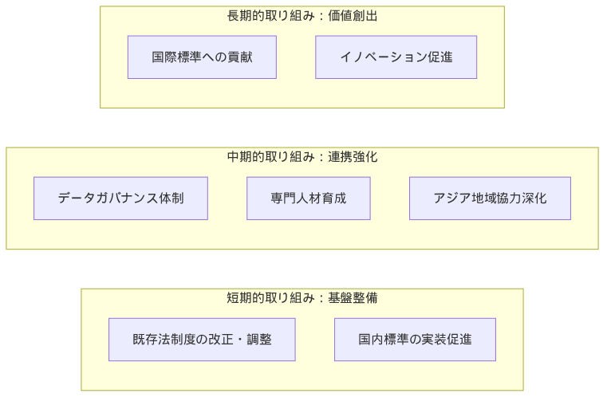
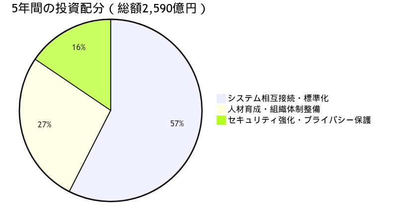

## 日本が世界をリードすべき領域

### グローバル競争で先行可能な分野

::: {.callout-important}
**日本が獲得すべきアウトカム**：

医療データ基盤の国際標準化をリードすることで、日本は以下の戦略的価値を獲得できる：

1. **経済的価値**：アジア太平洋デジタルヘルス市場（2024年時点の予測：2030年に2,520億ドル・約37兆円規模、CAGR 23.1%）[@GrandViewAPAC2024]の主導権確保
2. **産業競争力**：日本発の医療IT・創薬プラットフォームの国際展開基盤
3. **社会的価値**：超高齢社会ソリューションの輸出による国際貢献
4. **地政学的価値**：医療データ主権を通じたアジア地域でのソフトパワー強化
5. **イノベーション創出**：14億人規模のリアルワールドデータによる創薬・医療機器開発の加速

これらの実現により、日本は「医療データ立国」として、欧州（EHDS）、米国（TEFCA）と並ぶ第三極を形成できる。
:::

::: {.callout-tip}
**戦略的機会**：EHDSが2029年本格稼働であることを踏まえ、日本は2027年までにアジア標準を確立し、グローバルスタンダードの一角を担うことが可能。
:::

**1. アジア健康データ空間（AHDS）の創設**

日本は、アジア太平洋地域における医療データ基盤の標準化を主導する絶好の機会を有している。EHDSが欧州27カ国で統一基準を確立しようとしている今、アジア地域でも同様の枠組みが必要である。ASEAN（2024年：人口6.78億人、GDP3.9兆ドル）[@ASEANStats2024]、中国（2024年：人口14.08億人、GDP14.72兆ドル）[@ChinaStats2024]、日本（2024年：GDP4.25兆ドル）[@IMF2024]、韓国（2024年：GDP1.67兆ドル）[@IMF2024]、インド（2024-25年度：人口14億人超、GDP3.91兆ドル）[@IndiaGDP2025]を合わせた地域は、人口約37億人、GDP合計約28兆ドルという巨大な経済圏を形成している。この経済圏における医療データ市場は、アジア太平洋デジタルヘルス市場として2030年に2,520億ドル規模に成長すると予測されており[@GrandViewAPAC2024]、その標準化を主導することで、日本の医療IT産業は優先的な市場アクセス、技術標準の決定権、そして先行者利益を獲得できる。

AHDSの技術基盤として、日本は以下の強みを活かすことができる。第一に、日本のNDB（レセプト情報・特定健診等情報データベース）は「レセプト情報の収集率は全保険請求情報の95%以上」であり、「2009（平成21）年度診療分からの電子化されたレセプト情報」を蓄積している[@NDB2024]。この15年以上の運用経験から得られた課題と解決策は、他国がシステムを構築する際の参考事例となり得る。第二に、HL7 FHIR JP Coreの実装経験[@JPCore2023]により、国際標準と各国固有の要件を調和させる技術的知見を持つ。第三に、2027年のEHDS実施法令制定前にアジア標準を確立することで、欧州・米国・アジアの三極構造における主導権を確保できる。

**2. 高齢化社会ソリューションの国際展開**

アジア諸国の急速な高齢化は、日本の高齢者医療・介護分野における強みを活かせる重要な機会を提供している。内閣府の高齢社会白書によれば、「韓国が18年、シンガポールが17年など、今後、一部の国で、我が国を上回るスピードで高齢化が進むことが見込まれている」[@CAO2020]。日本が高齢化率7%から14%への移行に24年を要したのに対し、これらの国々は大幅に短縮している。つまり、アジア諸国は日本が24年かけて直面した課題を、わずか17-18年という短期間で経験することになる。この急速な変化に対応するため、日本が長期間かけて蓄積した経験とソリューションへの需要が急激に高まることが予想される。

日本は1961年の皆保険制度導入以降[@UniversalHealth1961]、世界に先駆けて以下の高齢化対応システムを構築してきた：

- **介護保険制度（2000年～）**：要介護認定の標準化と介護サービスの体系化[@LongTermCare2000]
- **認知症対策（オレンジプラン等）**：早期発見・診断・ケアの統合的アプローチ[@OrangePlan2012]
- **地域包括ケアシステム**：医療・介護・生活支援の一体的提供モデル[@CommunityBasedCare2014]
- **介護ロボット・福祉機器**：ISO 13482の国際標準化主導[@ISO13482]

これらの包括的な高齢化対応システムは、60年以上にわたる段階的な発展の成果である。

これらのシステムと、そこから生成される膨大なリアルワールドデータを組み合わせることで、「高齢化対応パッケージ」として、制度設計、技術ソリューション、運用ノウハウを各国の実情に合わせて提供できる可能性がある。実際に、日本は以下のようなデータ駆動型ツールの開発と国際展開を進めている：

- **介護の質評価指標（QI）**：2021年に導入されたLIFE（科学的介護情報システム）データベースは、疾患、身体・認知機能、ADL、栄養状態等を統合的に収集し、エビデンスベースの介護サービス提供を支援[@LIFE2021]
- **認知症リスク予測アルゴリズム**：国立長寿医療研究センター（NCGG）主導のJ-MINT研究では、AIを活用した認知症リスク予測とマルチドメイン介入の効果検証を実施[@JMINT2021]
- **フレイル判定基準**：J-CHS基準として国際標準のCHS基準を日本向けに適応し、アジア太平洋フレイル管理ガイドラインの基盤として採用[@JCHS2020][@AsiaFrailty2017]

これらのツールは既にアジア太平洋地域での標準化が進んでおり、各国の文化的背景に適応させながら展開する基盤が整っている。

**3. 災害医療・パンデミック対応プラットフォーム**

日本は、東日本大震災（2011年）、熊本地震（2016年）、COVID-19パンデミック（2020年～）など、大規模災害と感染症危機の両方を経験し、その都度、医療対応システムの改善と知見の蓄積を進めてきた。特に、災害派遣医療チーム（DMAT）は2005年に設立され、2024年1月時点で838の指定医療機関を擁する体制に成長している[@DMAT2024]。東日本大震災では、発災から数日のうちに自衛隊・警察・消防・医療チームなど、国内外から大規模な人員が派遣され、その規模は最大時で自衛隊だけでも10万人以上に達した[@bouei2011]。広域災害救急医療情報システム（EMIS）は、病院情報、患者情報、医療資源情報をリアルタイムで共有するインターネット基盤システムである[@EMIS2015]。COVID-19における病床管理システム（G-MIS）はパンデミック対応用に特別に開発され[@GMIS2020]、これらは危機時の医療データ管理において世界的にも先進的な事例となっている。

これらの経験を体系化し、国際標準プラットフォームとして展開する根拠は強固である。WHOは2025年5月20日の第78回世界保健総会において、歴史的なパンデミック協定（WHO Pandemic Agreement）を正式に採択した（賛成124カ国、反対0カ国、棄権11カ国）[@WHO2025PandemicAgreement]。この協定では、「病原体アクセス・利益配分システム（PABS）」により、パンデミック時に製薬企業が安全で効果的なワクチン・治療薬・診断薬の生産量の20%をWHOに提供し、公衆衛生リスクとニーズに基づいて配分する仕組みが定められている。特に開発途上国のニーズへの特別な配慮が明記されており、今後PABSの詳細な制度設計と、グローバルサプライチェーン・ロジスティクスネットワーク（GSCL）の構築が進められる予定である。日本のDMAT、EMIS、G-MISの統合システムは、災害・パンデミック双方に対応できる世界でも稀有な実装モデルとして、このような国際的枠組みにおける緊急時対応システムの具体的実装例となり得る。

さらに、日本は2023年のG7議長国として「グローバル・ヘルス・アーキテクチャ（GHA）の強化」を主導し、「医療対策の公平なアクセスに関するG7広島ビジョン」を発表した。このビジョンでは、パンデミック予防・備え・対応（PPR）の強化、ユニバーサル・ヘルス・カバレッジ（UHC）の推進、抗菌薬耐性（AMR）対策などが重点分野として位置づけられ、具体的な取り組みとして「MCMデリバリー・パートナーシップ（MCDP）」の立ち上げが発表された[@G7Hiroshima2023]。WHO緊急医療チーム（EMT）認証においても、日本の国際緊急援助隊医療チームは2023年11月にEMT Type 2認証を再取得し、災害時医療の質の確保と国際的な調整メカニズムの推進に貢献している[@WHOEMT2023]。

日本がDMAT、EMIS、G-MISを通じて蓄積してきた運用ノウハウ（リアルタイムでの病床稼働状況の可視化、医療物資の需給マッチング、患者搬送の調整等）は、国際的な災害医療・パンデミック対応の参考事例となっている。これらのシステムの技術的要素（データ収集・分析・可視化機能）を、国際標準に準拠したAPI設計やクラウドベースのアーキテクチャとして再構築することで、他国での導入や国際連携を促進する可能性がある。

**4. 次世代医療技術の標準化主導**

日本の医療機器産業は、特に内視鏡分野で圧倒的な優位性を持っている。オリンパス社は消化器内視鏡の世界市場で約70%のシェアを占め[@Olympus2024]、富士フイルム、HOYA（PENTAX Medical）を含む日本企業が内視鏡市場の大部分を支配している[@METI2024Medical]。また、画像診断装置（CT、MRI）、超音波診断装置などの分野でも強い競争力を維持している。

これらの医療機器から生成される大量の医療画像データの活用において、日本は規制面での先進的な取り組みを進めている。PMDA（独立行政法人医薬品医療機器総合機構）はAI・機械学習を活用した医療機器プログラム（SaMD）の承認審査に関するガイダンスを策定し、AI画像診断支援システムや継続的学習システムなどの規制枠組みを整備している[@PMDA2024AI]。さらに、日本はICMRA（医薬品規制調和国際会議）のAI/ML作業部会において、医療AIの性能評価基準と規制枠組みの国際的な議論に積極的に参加している[@ICMRA2024]。これらの取り組みにより、日本の医療機器産業の強みと規制面での知見を組み合わせ、次世代医療技術の国際標準形成に貢献する基盤が整いつつある。

なお、日本では2018年に規制サンドボックス制度が導入され[@RegulatorySandbox2018]、革新的な技術やビジネスモデルの実証を促進する環境も整備されており、医療分野を含む様々な分野でのイノベーション創出が期待されている。

アジア太平洋地域における規制調和の面では、日本は継続的な取り組みを進めている。2019年3月、APECはPMDAを医療機器規制のパイロット訓練センター（Center of Excellence）として承認し、PMDAはアジア医薬品・医療機器研修センター（PMDA-ATC）を通じて各国規制当局職員への研修を提供している[@APEC2019CoE]。2019年6月に健康・医療戦略推進本部が策定した「アジア医薬品・医療機器規制調和グランドデザイン」では、アジア規制当局からの長期研修受け入れ、薬事規制制度に関するセミナーの実施、規制当局担当者への研修提供などを通じた人材育成と規制調和の推進が明記されている[@GrandDesign2019]。さらに、2024年7月にはPMDAがバンコクに初の海外事務所を開設し、現地での規制調和活動を強化している[@PMDABangkok2024]。

これらの実績を基盤として、デジタルヘルス機器、AI医療機器、遠隔医療システムなどの次世代技術についても、日本の規制経験と技術的知見を活かした国際協調が可能である。特に、AHWP（Asian Harmonization Working Party）などの既存の枠組みを通じて[@AHWP2023]、日本が培ってきた医療機器規制のノウハウをアジア地域と共有し、相互に学び合う環境づくりに貢献することが期待される。

## 戦略的優先事項

日本が医療データ活用を推進する上で取り組むべき優先事項を、現実的な実施可能性と期待される効果の観点から整理する。

{width=100%}

### 1. 短期的取り組み：基盤整備

::: {.fact}
**事実**：EUは2025年3月に規則を発効し、2027年3月までに実施法令を整備する[@EU2025; @EHDS2025timeline]。日本でも医療データ活用の基盤整備が急務となっている。
:::

**既存制度の活用と段階的改善**：

| 取り組み | 現状 | 具体的施策例 | 実施主体 |
|----------|------|----------------|----------|
| 次世代医療基盤法の活用 | 認定事業者による匿名加工医療情報の利活用[@NextGenMedLaw2024] | オプトアウト通知の電子化・簡素化、認定事業者間のデータ連携基準策定、利活用事例集の公開による認知度向上 | 内閣府・厚労省 |
| 個人情報保護法の運用 | 医療分野の特性への配慮が不十分[@PersonalInfoProtect2024] | 医療データ特有のリスクに対応した実務ガイドライン策定、仮名加工医療情報の具体的な活用シナリオ提示、医療機関向けQ&A整備 | 個人情報保護委員会 |
| 電子カルテ標準化 | HL7 FHIR JP Core策定済み[@JPCore2023] | 既存システムからFHIR形式への変換ツール無償提供、段階的移行ロードマップ策定、中小医療機関向け導入補助金制度創設 | 厚労省・MEDIS |
| データセキュリティ | 医療機関でのばらつき[@MedInfoSecurity2023] | サイバーセキュリティ成熟度評価ツール開発、地域別セキュリティ支援センター設置、インシデント対応訓練の義務化 | 厚労省・NISC |

### 2. 中期的取り組み：連携強化

::: {.analysis}
**考察**：医療データの適切な管理と活用には、ガバナンス体制の構築と専門人材の育成が不可欠である。既存の組織・制度を活用しながら、段階的に体制を強化することが現実的である。
:::

**データガバナンスと人材育成の推進**：

| 取り組み | 現状 | 具体的施策例 | 実施主体 |
|----------|------|----------------|----------|
| データガバナンス体制 | データ管理責任者の設置率が低く、利用ポリシーや監査体制が未整備[@DataGovernanceJapan2024] | 日本版「医療データアクセス機関」設立準備、データ利用審査の統一基準策定、医療機関向けデータガバナンス成熟度モデル導入 | 厚労省・医療団体 |
| 専門人材育成 | 先端IT人材が2030年に約54.5万人不足の見込み[@METI2019ITDemand] | 医療データ分析専門職の育成プログラム開発、医療情報学修士課程の定員拡充、医療機関でのOJT研修制度整備 | 文科省・厚労省 |
| 地域医療連携 | 279地域でネットワークが運用、1NWあたり平均143施設が参加[@RegionalMedicalNetworks2024] | 地域医療ネットワークの段階的統合、FHIR準拠の共通APIゲートウェイ構築、地域間データ連携実証事業の実施 | 都道府県・厚労省 |
| アジア地域協力 | PMDAが2019年にAPEC医療機器規制調和の訓練センター（Center of Excellence）として承認され各国規制当局へ研修提供[@APEC2019CoE]、AHWP（アジア医療機器規制調和会議）で医療機器審査基準の標準化を推進[@AHWP2023]、APEC Digital Health Roadmap 2030に基づきデジタルヘルス相互運用性を推進[@AsianDataCollaboration2023] | ASEANとの医療データ相互運用性パイロット事業開始、アジア版FHIRプロファイル共同開発、PMDA-ATCバンコク事務所での現地研修プログラム拡充 | PMDA・厚労省 |
| データ品質基準 | ベンダ固有規格により標準規格活用が進まず独自マスター使用が継続[@MHLWStandardSurvey2023] | ISO/TC 215準拠の日本版医療データ品質基準（JMD-Q）策定、データ品質認証制度の導入、品質監査ツールの開発・配布 | 学会・標準化団体 |

### 3. 長期的取り組み：価値創出

::: {.analysis}
**考察**：日本の強みである医療機器産業、高齢者医療、災害医療などの分野で蓄積された知見を、国際標準形成に活かしつつ、医療データを活用した新たな価値創出を目指す。
:::

**国際標準への貢献とイノベーション促進**：

| 取り組み | 現状 | 具体的施策例 | 期待される成果 |
|----------|------|----------------|---------------|
| 国際標準形成 | IMDRF、ISO等への参画[@IMDRFStandards2024] | ISO/TC 215での医療AI品質評価基準の主導、内視鏡AI診断の国際標準規格提案、継続学習型医療AIの認証フレームワーク策定 | 日本発技術の国際展開促進、年間輸出額1兆円規模 |
| 新サービス創出 | 限定的な二次利用[@NextGenMedLaw2024] | 医療データ取引市場の創設、製薬企業向けRWD提供プラットフォーム構築、保険会社との健康増進サービス共同開発 | デジタルヘルス産業5兆円市場創出、新規雇用10万人 |
| アジア相互運用 | 医療機器規制ではAHWP等の多国間協力が進む一方[@AHWP2023]、医療データ相互運用は二国間協力が中心 | アジア健康データ空間（AHDS）の構築、APEC加盟国での相互運用性フレームワーク確立、越境診療・処方の段階的実現 | アジア太平洋地域の医療データ市場形成、日本企業の市場アクセス確保 |
| 高齢社会ソリューション | 介護保険制度[@LongTermCare2000]、認知症対策[@OrangePlan2012]、地域包括ケア[@CommunityBasedCare2014]等の国内実績 | 認知症ケア・介護ロボット・遠隔見守りの統合パッケージ輸出、ASEAN各国での高齢者ケアセンター展開、介護人材育成プログラムの国際展開 | アジア高齢者ケア市場でのシェア獲得、関連ソリューション輸出拡大 |
| 研究開発促進 | 次世代医療基盤法の認定事業者経由での限定的なデータアクセス[@NextGenMedLaw2024] | 大規模統合医療データベース構築、AI創薬プラットフォームの商用化、希少疾患研究の国際コンソーシアム主導 | 新薬開発期間の短縮、開発コスト削減、新薬候補創出の加速 |

::: {.callout-note}
**段階的実施の重要性**：上記の取り組みは、短期（基盤整備）・中期（連携強化）・長期（価値創出）の3段階で段階的に実施することが重要である。急激な変革を避け、既存システムとの共存を図りながら、確実な成果を積み重ねていく漸進的アプローチが、日本の医療データ活用推進において最も現実的な道筋である。

一方で、EHDSが2029年に本格稼働し、米国TEFCAも2024年から実装が進む中、日本が国際競争力を維持するためには、「慎重さ」と「迅速性」のバランスが不可欠である。段階的実施を言い訳とした先送りではなく、明確な期限設定と実行責任の所在を定めた上で、確実な推進力を持って取り組むことが求められる。
:::

## 投資規模の試算

### 必要投資額（5年間）

::: {.fact}
**事実**：EUはデジタルヘルス・EHDS関連で複数の資金枠組みを設定している。

EU4Healthプログラムについて、欧州委員会は以下のように述べている：
> "with an initial €5.3 billion budget for the 2021-27 period, reduced to €4.4 billion following the revision of the 2021-2027 MFF"（2021-27年期間の当初予算53億ユーロは、2021-2027年多年度財政枠組み（MFF）の見直しにより44億ユーロに削減）[@EU4Health2021]

EHDS実装について、欧州委員会は以下のように明記している：
> "The Commission will provide over €810 million: €280 million under the EU4Health Programme and the rest via the Digital Europe Programme, Connecting Europe Facility and Horizon Europe"（欧州委員会は8.1億ユーロ以上を提供：EU4Healthプログラムから2.8億ユーロ、残りはDigital Europe Programme、Connecting Europe Facility、Horizon Europeから）[@EHDSFunding2024]

さらに、復興レジリエンス基金（Recovery and Resilience Facility: RRF）について、欧州委員会は以下のように報告している：
> "Member States have budgeted €14 billion for investments in digital health under the Recovery and Resilience Facility (RRF)"（加盟国は復興レジリエンス基金（RRF）の下でデジタルヘルスへの投資に140億ユーロを予算化している）[@RRFDigitalHealth2024]

RRFは、COVID-19パンデミックからの経済復興を支援するためのEUの一時的な資金提供メカニズムで、NextGenerationEUの中核をなすものである。この基金は、経済をより持続可能で、強靭で、グリーン・デジタル移行に対応できるようにすることを目的としている。

**参考：EUの投資規模との比較検討**：

1. **EUのデジタルヘルス関連投資総額（概算）**：
   - EU4Health: 44億ユーロ（約6,600億円、1ユーロ=150円換算）
   - EHDS直接投資: 8.1億ユーロ（約1,215億円）
   - RRFデジタルヘルス: 140億ユーロ（約2兆1,000億円）
   - **合計: 約192億ユーロ（約2兆8,800億円）**

2. **GDP比での調整**：
   - EU GDP: 約16.6兆ドル（2023年）[@EUGDP2023]
   - 日本GDP: 約4.2兆ドル（2023年）[@JapanGDP2023]
   - **GDP比: 日本/EU ≈ 0.25（約1/4）**

3. **日本における現実的な投資規模の検討**：
   - GDP比での単純計算では2兆8,800億円 × 0.25 = 約7,200億円となるが、これは機械的な試算
   - **より現実的な投資規模として、5年間で約2,590億円（年間約518億円）を提案**
     - 既存システムの相互接続・標準化：約1,490億円
     - セキュリティ強化・プライバシー保護：約400億円  
     - 人材育成・組織体制整備：約700億円
   - この規模は、既存インフラを最大限活用し、段階的導入により初期投資を抑制した試算
   - 日本の投資規模を検討する際の考慮事項：
     - EUは27カ国の異なるシステムを統合する必要があるのに対し、日本は単一国家
     - 日本は既にNDB（レセプトDB）、介護DB、DPCデータベース等の全国規模データベースが稼働中
     - 電子カルテ普及率は病院で91.2%、診療所で49.9%（2020年）[@MHLW2020EMR]
     - マイナンバーカードを活用した医療情報連携基盤が整備途上
   - EUとの比較から見た日本の優位性：
     - **システム統合の効率性**: EUは27カ国分の統合コスト → 日本は単一国家で効率的
     - **言語・制度の統一**: EUは24言語対応が必要 → 日本は単一言語
     - **既存インフラ活用**: EUは新規構築 → 日本は既存システムの改修・接続が中心
:::

#### 6.3.1.1 投資内訳の詳細

::: {.callout-note}
**日本の医療データ基盤整備投資内訳**

1. **既存システムの相互接続・標準化（約1,490億円）**：
   - 医療機関のシステム改修[@MHLW2023Facilities]
     - 病院（約8,100施設）：厚労省の電子カルテ情報共有サービス接続改修事業における標準的な改修費用[@MHLWSubsidy2024]
       - 健診実施医療機関：200床以上1,316万円、200床未満1,091万円（事業額上限、補助率50%）
       - 健診未実施医療機関：200床以上1,016万円、200床未満817万円（事業額上限、補助率50%）
       - 推定改修費用：1施設あたり平均1,200万円 × 8,100施設 = 約972億円
     - 診療所（約10.5万施設）：クラウド型への移行やAPI接続対応
       - 推定改修費用：1施設あたり平均100万円 × 10.5万施設 = 約1,050億円
       - ただし、多くの診療所は段階的導入のため、初期は約30%（3.5万施設）が対応と想定 = 約350億円
   - 地域医療連携ネットワーク（279地域）の相互接続・標準化：約150億円
     - 日本医師会総合政策研究機構の2023年度調査によると、279地域でネットワークが運用中[@JMARI2023]
     - 同調査では、1ネットワークあたりの平均構築費用（累計）は2億5,409万1千円、2024年度の平均年間運営予算は1,185万円と報告されている[@JMARI2023]
     - 相互接続・標準化対応改修：既存システム構築費用の約20%程度と想定（平均構築費用2.54億円の20% = 約5,000万円/地域）× 279地域 = 約140億円
   - データ変換・移行支援、研修・技術支援等：約28億円
     - **データ変換ツール開発・提供（約10億円）**：
       - **開発フェーズ（約4億円）**：
         - HL7 v2→FHIR変換エンジン開発：1.5億円（主要10パターン対応）
         - SS-MIX2→FHIR変換モジュール：1億円
         - 各ベンダー（主要20社）向けアダプター開発：1億円（500万円×20社）
         - テストツール・SDK・ドキュメント整備：0.5億円
       - **導入支援フェーズ（約3億円）**：
         - パイロット病院での実証実験（20施設）：1億円
         - 各ベンダーへの技術移転・研修：1億円
         - 導入コンサルティング・問い合わせ対応体制：1億円
       - **保守・運用フェーズ（約3億円）**：
         - 5年間の保守・アップデート：年間6,000万円×5年
       - 参考：厚労省の「電子カルテ情報共有サービス」等の全国共通基盤開発では数億円規模の投資が一般的
     - **医療従事者向け研修プログラム（全国展開：約8億円）**：
       - 東京都医療機関デジタル化推進セミナーのような研修を全国展開[@TokyoDXSeminar2024]
       - 全国約8,100病院×研修費10万円（基礎編・実践編）= 約8.1億円
       - オンライン研修プラットフォーム構築・運用費を含む
       - 参考：令和6年度補正予算では介護人材確保・職場環境改善等事業に806億円が計上[@MHLWSupplementaryBudget2024]
     - **技術支援センター設置・運営（5年間：約10億円）**：
       - 全国5ブロック（北海道・東北、関東、中部、関西、中国・四国・九州）に設置
       - 各センター年間運営費：4,000万円（人件費3名＋運営費）× 5拠点 = 2億円/年
       - 5年間の総額：2億円 × 5年 = 10億円
       - 参考：PMDAアジア医薬品・医療機器研修センター（PMDA-ATC）の運営実績[@APEC2019CoE]
2. **セキュリティ強化・プライバシー保護（5年間で約400億円）**：
   - **サイバーセキュリティ対策強化（約200億円）**：
     - 厚労省「医療機関におけるサイバーセキュリティ確保事業」：110億円（2024-2025年度予算）[@MHLWCybersecurity2024]
     - 対象：電子カルテ導入済み20床以上の病院（約2,000施設）
     - 外部ネットワーク接続の安全性検証、オフラインバックアップシステム構築
     - 追加的なセキュリティ投資（民間負担分）：90億円
   - **段階的なゼロトラスト環境への移行（約100億円）**[@DigitalAgencyZeroTrust2022]：
     - 重点病院（500施設）への先行導入：50億円
     - ID管理・認証、EDR、CASB等の段階的実装
     - 中小医療機関向けクラウド型セキュリティサービス：50億円
   - **医療データ暗号化・匿名化技術の標準化（約100億円）**[@NextGenMedicalAct2024]：
     - 次世代医療基盤法認定事業者の技術開発支援：30億円
     - 匿名加工・仮名加工処理技術の標準化：30億円
     - 全国展開のためのシステム実装・保守：40億円
3. **人材育成・組織体制整備（約700億円）**：
   - **医療データ分析専門人材育成（約400億円）**：
     - 既存の医療情報技師（約2.7万人認定）[@JAMI2024]の高度化研修：1人あたり50万円 × 1万人 = 50億円
     - 新規人材育成（データサイエンティスト養成）：
       - 第四次産業革命スキル習得講座（経産省認定）等の活用[@METI2024Reskill]
       - 専門実践教育訓練給付金による受講費用の50-80%補助を前提
       - 実質負担額：1人あたり年間100万円 × 5年間 × 5,000人 = 250億円
     - 大学・大学院での専門コース設置支援：100億円（20大学 × 5億円）
   - **医療機関のデジタル人材配置支援（約200億円）**：
     - 病院（8,100施設）への配置支援：1施設あたり200万円/年 × 5年 × 2,000施設（重点病院）= 200億円
     - 診療所向けは既存のIT導入補助金制度を活用
   - **データガバナンス体制構築支援（約100億円）**：
     - ガイドライン策定・普及：10億円
     - 医療機関向けガバナンス研修：50億円（全病院対象）
     - データ管理責任者（CDO）認定制度構築・運営：40億円
:::

#### 6.3.1.2 投資配分と実施計画

**投資配分案**：



| カテゴリー | 投資額（億円） | 割合 |
|------------|---------------|------|
| システム相互接続・標準化 | 1,490 | 57.5% |
| 人材育成・組織体制整備 | 700 | 27.0% |
| セキュリティ強化・プライバシー保護 | 400 | 15.5% |
| **合計** | **2,590** | **100%** |

### ROI（投資対効果）予測

::: {.callout-warning}
**野心的目標設定の重要性**：
以下に示すROI予測は、国内外の先進事例とエビデンスに基づく「期待効果」である。これらは自動的に実現される成果ではなく、官民が一体となって戦略的に追求すべき目標値として位置づけるべきである。特に、デジタル化の恩恵を最大化するには、単なるシステム導入を超えて、業務プロセスの根本的な変革と、データ活用による新たな価値創造への積極的な取り組みが不可欠である。
:::

EHDS参考による医療データ基盤構築の日本における期待効果は、**年間総額1.3兆円〜1.9兆円**と試算される。ただし、この試算には医療DX推進全般の効果が含まれており、データ基盤固有の効果はこの一部である。投資額2,590億円は5年間の段階的投資を想定しており、効果の完全実現には7-10年程度を要すると考えられる。期待される効果は以下の5つの分野に分類される：

#### 1. 医療費削減効果（年間5,000億円〜8,600億円）

**1.1 重複検査の削減（年間1,600億円〜3,200億円）**

*※この効果はEHDS型データ基盤の中核機能である医療機関間情報共有により直接実現*

厚生労働省は医療DXの効果について以下のように指摘している：

> 「医療機関間での情報共有により、重複検査の削減が期待される。電子カルテ情報共有サービスの活用により、患者の検査履歴・投薬履歴を医療機関間で共有することで、医療の質向上と効率化を実現する」[@mhlw2024dx]

**算出根拠**：

- 医療費全体（約47兆円）に占める検査・画像診断の割合：約8-10%（推計3.8〜4.7兆円）[^diagnostic_cost_note]

[^diagnostic_cost_note]: この推計は、社会医療診療行為別統計において入院患者の画像診断が日割り点数の1.0%、検査が2.0%を占めること[@MHLW2023MedicalPractice]や、日本のCT・MRI設置密度が世界最高水準であること[@MHLW2023Facilities]を総合的に勘案した概算値である。より詳細な費用構造分析には、診療行為別の詳細な費用調査が必要である。

- 複数医療機関受診による重複検査の発生：医療機関間の情報共有不足により発生[^duplicate_test_note]

[^duplicate_test_note]: 厚生労働省の医療費適正化政策において、重複受診・重複検査は医療費増加要因として指摘されているが、全国レベルでの発生率を示す公的統計は限定的である。地域の健康保険組合等では重複受診対策が実施されており、情報共有による削減効果が期待されている。

- 情報共有による重複検査削減可能率：80%と仮定

**算出式**：
```
削減額 = 検査関連医療費 × 重複検査発生率 × 削減可能率
      = 4兆円 × 5〜10% × 80%
      = 1,600億円〜3,200億円/年
```

**1.2 予防医療・重症化予防（年間3,400億円〜5,400億円）**

経済産業省は健康経営の効果について具体的な数値を示している：

> 「健康経営に取り組む企業では、従業員一人当たりの医療費が平均的に10%程度削減される傾向が見られる。また、プレゼンティーイズム（健康問題による生産性低下）の改善により、労働生産性が向上する」[@meti2024health]

**算出根拠**：

- 生活習慣病関連医療費：約10兆円（医療費全体の約20%）
- 糖尿病患者数：約1,000万人、透析患者数：約35万人
- 人工透析医療費：1人あたり年間約500万円
- 重症化予防プログラムによる透析移行抑制率：20-30%と仮定

**算出式**：
```
削減額 = (生活習慣病医療費 × 予防効果率) + (透析新規導入抑制による削減)
      = (10兆円 × 3〜5%) + (4万人/年 × 500万円 × 20%)
      = 3,000億円〜5,000億円 + 400億円
      = 3,400億円〜5,400億円/年
```

#### 2. 業務効率化効果（年間2,200億円〜4,400億円）

**2.1 事務作業の削減（年間1,000億円〜2,000億円）**

厚生労働省の医療経済実態調査によると、一般病院における給与費は医業・介護収益の約57%を占めており[@MHLW2024MedicalEconomic]、医療従事者の事務作業負担軽減によるコスト削減効果は大きい。

**算出根拠**：

- 国民医療費（2022年度：46.7兆円）[@MHLW2022NationalMedical]のうち、医療機関の費用構造では人件費が最大の割合を占める
- 医療従事者の事務作業負担は広く認識されている課題であり、医師事務作業補助者の配置やタスクシフト/シェアが政策的に推進されている
- デジタル化による期待効果：電子カルテの完全普及、レセプト電子化、オンライン資格確認システムなどの導入により、事務作業の効率化が期待される

医療DX推進により、医療従事者の業務効率改善を通じて費用削減が期待される。医療機関の費用構造において人件費が大きな割合を占めることから、業務効率化の影響は大きい。ただし、具体的な人件費総額のデータが明確でないため、保守的に見積もり：

- 推定削減額：1,000億円〜2,000億円/年

**2.2 AI活用による診断支援（年間1,200億円〜2,400億円）**

AI診断支援システムの導入により、診断時間の短縮と精度向上が期待される。

**算出根拠**：

- 画像診断関連医療費：約2兆円/年（推計）
- 放射線科医・病理医等の専門医不足による診断遅延コスト
- AI導入による診断時間短縮率：30-50%
- 診断精度向上による不要な再検査削減率：10-20%と仮定

**算出式**：
```
削減額 = (画像診断費 × 効率化率) + (再検査削減による効果)
      = (2兆円 × 5〜10%) + (2兆円 × 10% × 10〜20%)
      = 1,000億円〜2,000億円 + 200億円〜400億円
      = 1,200億円〜2,400億円/年
```

#### 3. 新産業創出効果（年間5,000億円）

**3.1 デジタルヘルス市場の成長**

*※新産業創出効果の一部は医療DX全般、一部はデータ基盤活用による直接効果*

富士経済の調査によると、医療DX推進により多岐にわたる市場成長が期待される[@fujikeizai2023]：

**既存市場の拡大**：

- 電子カルテ・PHR市場：2,425億円（2030年予測）
- リアルワールドデータ分析市場：320億円（2030年予測）

**新規市場創出**：

- AI診断支援システム市場：約1,000億円（推計、海外事例より）
- 遠隔医療・オンライン診療市場：約500億円（推計）
- ウェアラブルデバイス・健康管理アプリ市場：約800億円（推計）

**創薬支援効果**（国内製薬業界研究開発費：年間約2兆円）：

- 開発期間短縮（2-3年）による機会コスト削減：約20-30%
- 臨床試験の効率化による開発コスト削減：約20-30%
- 成功確率向上による無駄な開発の削減：約10-15%

**算出式**：
```
新産業創出総額 = 既存市場拡大 + 新規市場創出 + 創薬効率化効果の一部
               = (2,425億円 + 320億円) + (1,000億円 + 500億円 + 800億円) + α
               = 2,745億円 + 2,300億円 + α
               ≈ 5,000億円/年
```

#### 4. 輸出産業化効果（年間1,000億円〜1,500億円）

**4.1 アジア太平洋市場への展開**

日本の医療技術の競争優位（内視鏡70%シェア、画像診断装置等）を活かし、デジタルソリューション付加価値による輸出拡大が期待される。

**算出根拠**：

- アジア太平洋デジタルヘルス市場規模：2030年に2,520億ドル（約37兆円）[@GrandViewAPAC2024]
- 現在の日本の医療機器輸出額：約8,000億円/年（2022年実績）[@METI2023Medical]
- 日本の競争優位分野：内視鏡（世界シェア約70%）、画像診断装置（CT/MRI）、高齢者ケアソリューション、医療データ分析・AI診断支援

**算出式**：
```
推定輸出額 = 市場規模 × 獲得可能シェア率
          = 37兆円 × 0.3〜0.5%（保守的推計）
          = 1,110億円〜1,850億円/年

または

推定輸出額 = 既存医療機器輸出 × デジタル化による増加率
          = 8,000億円 × 12.5〜18.75%（デジタルソリューション付加価値）
          = 1,000億円〜1,500億円/年
```

- 推定輸出額：1,000億円〜1,500億円/年（2030年）

#### 5. 健康経営効果（参考事例）

ジョンソン・エンド・ジョンソンの健康経営プログラムは世界的な成功事例として知られている：

> 「私たちのWellness & Prevention プログラムへの投資は、1ドルあたり3ドルのリターンを生み出しています。これは医療費の削減、欠勤率の低下、生産性の向上を通じて実現されています」[@jnj2024health]

国内企業でも従業員の病欠が年20%減少、医療費負担が10%削減の実績がある。

#### ROI総合評価

| 効果分野 | 年間効果額 | 主要な算出根拠 |
|----------|-----------|----------------|
| **1. 医療費削減** | **5,000〜8,600億円** | |
| ├ 重複検査削減 | 1,600〜3,200億円 | 検査費4兆円×重複率5-10%×削減率80% |
| └ 予防医療・重症化予防 | 3,400〜5,400億円 | 生活習慣病10兆円×予防効果3-5%+透析抑制400億円 |
| **2. 業務効率化** | **2,200〜4,400億円** | |
| ├ 事務作業削減 | 1,000〜2,000億円 | 医療DXによる業務効率改善（保守的推計） |
| └ AI診断支援 | 1,200〜2,400億円 | 画像診断2兆円×効率化5-10%+再検査削減 |
| **3. 新産業創出** | **5,000億円** | 既存市場拡大2,745億円+新規市場創出2,300億円 |
| **4. 輸出産業化** | **1,000〜1,500億円** | アジア太平洋市場37兆円×獲得シェア0.3-0.5% |
| **年間効果総額** | **1.3兆円〜1.9兆円** | **投資額2,590億円（5年間）** |
| **長期的ROI** | **500〜733%** | **完全実現時（7-10年後）の年間効果対累積投資比** |

::: {.callout-note}
**段階的な効果発現とリアルな投資回収**：

**効果発現スケジュール**：

- 初期段階：基盤構築期（効果10-20%）
- 拡大段階：普及促進期（効果30-60%）
- 成熟段階：本格活用期（効果70-90%）
- 完全実現段階：システム成熟期（効果100%）

**投資回収の現実的見通し**：

- 投資額2,590億円を段階的に実施
- 継続的な投資に対し、段階的に効果が発現
- 実質的な投資回収は中長期的に実現
- 効果の完全実現には、全医療機関での標準化、医療従事者のデジタルリテラシー向上、制度整備が前提

**リスク要因**：技術標準の変化、医療機関の導入遅延、人材不足、制度変更等により効果発現が遅れる可能性がある。
:::

## リスク管理戦略

### 主要リスクと対策

::: {.callout-important}
**重大リスクの認識**：
医療データ基盤整備は、技術的課題だけでなく、社会的受容性、現場の協力、法制度の整備など、多面的なリスク管理が不可欠である。特に以下の3つは、プロジェクト全体を頓挫させる可能性がある：

1. **個人情報漏洩による信頼失墜** - 一度の重大インシデントで国民の信頼を完全に失う
2. **医療現場の抵抗・変革疲労** - 現場の協力なくしては、どんなシステムも機能しない
3. **ベンダーロックインによる硬直化** - 特定企業への依存は、長期的な発展を阻害する
:::

**包括的リスクマトリクス**：

| リスク分類 | リスク内容 | 発生確率 | 影響度 | 対策 | 責任主体 |
|------------|------------|----------|--------|------|----------|
| **セキュリティ** | サイバー攻撃・情報漏洩 | 高 | 極大 | ゼロトラスト、SOC設置、継続的監査 | デジタル庁 |
| **社会的受容** | 市民の反対・理解不足 | 中 | 大 | 段階的導入、透明性確保、成功事例の可視化 | 厚労省 |
| **現場対応** | 医療従事者の抵抗・変革疲労 | 高 | 極大 | 業務負担軽減の実証、段階的移行、インセンティブ設計 | 厚労省・医師会 |
| **技術的課題** | システム障害・相互運用性欠如 | 中 | 大 | アジャイル開発、MVP、標準化徹底 | IT企業・MEDIS |
| **ベンダー依存** | ロックイン・技術的分断 | 高 | 大 | オープンスタンダード義務化、マルチベンダー環境 | デジタル庁・公取委 |
| **法制度** | 規制の硬直性・省庁縦割り | 高 | 大 | 規制サンドボックス、省庁横断タスクフォース | 内閣府 |
| **財政** | 予算不足・費用超過 | 中 | 中 | 官民連携、段階投資、効果測定 | 財務省 |
| **地域格差** | デジタルディバイド拡大 | 中 | 大 | 地方優先投資、クラウド型サービス | 総務省 |
| **国際競争** | 標準化競争での劣後 | 高 | 大 | 早期着手、AHDS主導、標準準拠 | 経産省 |
| **投資効果** | ROI未達成・便益過大評価 | 中 | 極大 | KPI設定、段階的効果測定、外部評価 | 会計検査院 |

::: {.callout-note}
**リスク評価の根拠と考察**：

上記の発生確率評価は、以下の実績データと動向分析に基づく：

**「高」確率と評価した根拠**：

- **サイバー攻撃**: 2021年以降、医療機関へのランサムウェア攻撃が急増。日本では徳島県つるぎ町立半田病院（2021年10月）、大阪急性期・総合医療センター（2022年10月）等で電子カルテシステムが長期間停止する重大事例が発生[@MHLWCyberIncident2023]
- **医療現場の抵抗**: オンライン資格確認システム導入時の混乱（2021-2023年）、診療所の電子カルテ普及率が49.9%に留まる現状[@MHLW2020EMR]
- **ベンダーロックイン**: 電子カルテ市場は上位5社で70%以上のシェアを占め、ベンダー独自仕様が標準化を阻害[@JAHISMarketShare2023]
- **法制度の硬直性**: 次世代医療基盤法の認定事業者は7社に留まり、活用が限定的[@NextGenMedLaw2024]

**「中」確率と評価した根拠**：

- **市民の反対**: マイナンバーカード保有率75%に達するも、デジタル化に対し「良いと思わない」11.1%、「どちらともいえない」38.0%の慎重論が存在。医療データ連携への不安は別途調査が必要[@DigitalAgency2024Progress]
- **地域格差**: 医療情報技師能力検定試験は全国13箇所で実施されるが、IT人材・医療従事者の地域偏在により実装格差が生じる可能性[@JAMI2024Statistics]
- **投資効果**: 政府情報システムに関する会計検査で、縦割りによる重複投資、個別最適化による非効率、予算要求段階での軌道修正困難などの構造的課題が指摘されている[@AccountingOffice2021IT]

**技術的課題を「低」から「中」に再評価した根拠**：

当初「低」としていたが、日本の大規模IT プロジェクトの実績を踏まえ「中」に修正：

- **大規模システム開発の課題**: 政府情報システムでは縦割りによる重複投資、個別最適による非効率、人材不足による品質・コスト両立の困難などの構造的課題が存在[@AccountingOffice2021IT]。年金記録システム（2017年刷新、約3,000億円投資）、マイナンバーシステム（2016年開始、複数の障害発生）等の事例もある
- **医療系システムの複雑性**: 既存の電子カルテシステムは各ベンダー独自仕様が多く、相互運用性確保は技術的に困難
- **レガシーシステム統合**: 既存の医療機関システム（NDB、DPC、電子カルテ等）との統合には技術的複雑性が伴う

ただし、完全な失敗リスクは以下の要因により「中」程度：

- 段階的実装による影響範囲の限定
- 既存システムとの並行運用による安全性確保
- クラウド技術の活用によるスケーラビリティの向上

なお、これらは定性的評価であり、実際の導入時には具体的な状況に応じたリスク評価の見直しが必要である。
:::

### リスク軽減のための優先対応事項

::: {.callout-note}
**段階的アプローチによるリスク軽減**：
上記のリスクを効果的に管理するため、以下の優先順位で対応することを推奨する：

**第1段階 - 信頼基盤の構築**：

- セキュリティ体制の確立（ゼロトラスト環境、SOC設置）
- 医療現場との対話プラットフォーム設置
- パイロット事業による成功事例創出（3-5病院）

**第2段階 - 制度・技術基盤の整備**：

- オープンスタンダードの義務化と認証制度
- 省庁横断ガバナンス体制の確立
- 地方展開のための支援体制構築

**第3段階 - 本格展開とスケーリング**：

- 全国展開と相互運用性の実現
- 国際標準への準拠と連携開始
- 継続的な効果測定と改善サイクル確立
:::

## 産業界への具体的推奨事項

日本の医療関連企業は、EHDSの動向を踏まえ、以下の2つの戦略的方向性に基づいてビジネス展開を検討することが重要である。

### 国内医療DX推進に向けた産業界の取り組み

**EHDS参考モデルによる日本国内の医療データ基盤整備**

::: {.callout-note}
**国内投資機会の概要**：
EHDSの技術仕様・制度設計を参考とした日本国内の医療データ基盤整備（投資規模：5年間約2,590億円）により、以下の投資領域で産業界の参画機会が見込まれる：

- **システム改修・標準化**（約1,490億円）：電子カルテ・医療情報システムの相互運用性向上
- **セキュリティ強化**（約400億円）：医療データ保護・サイバーセキュリティ対策
- **人材育成・組織整備**（約700億円）：デジタルヘルス人材の育成・研修

**期待される効果**：年間1.3兆円〜1.9兆円の経済効果（医療費削減、業務効率化、新産業創出）
:::

#### 対象企業カテゴリーと投資機会（国内市場）

**1. 医療機器メーカー**

- **対象例**：画像診断装置、検査機器、モニタリング機器製造企業

- **国内投資機会**（*新たなビジネス領域・収益機会*）：
  - 既存医療機器のHL7 FHIR対応改修サービス
  - 医療機関向け相互運用性認証・導入支援サービス
  - 国内標準準拠新製品開発における優先採用機会


- **対応例**（*具体的な技術実装・サービス提供方法*）：
  - HL7 FHIR JP Core準拠のデータ出力機能追加
  - 厚労省標準規格（HL7 FHIR、DICOM等）への完全対応
  - 医療機関向け導入・運用支援体制の強化

**2. 電子カルテ・医療情報システムベンダー**

- **対象例**：病院情報システム、地域医療連携システム開発企業

- **国内投資機会**（*新たなビジネス領域・収益機会*）：
  - 医療機関システム改修事業への参入機会
  - クラウド型電子カルテサービスの拡大（診療所向け）
  - 地域医療ネットワーク統合プロジェクトへの参画

- **対応例**（*具体的な技術実装・サービス提供方法*）：
  - HL7 FHIR JP Core実装の加速・API標準化
  - 厚労省電子カルテ情報共有サービス対応
  - 医療機関間データ交換機能の実装
  - **重要**：ベンダーロックイン回避のためのオープンスタンダード準拠

**3. 製薬・バイオテクノロジー企業**

- **対象例**：新薬開発、臨床試験実施企業

- **国内投資機会**（*新たなビジネス領域・収益機会*）：
  - 次世代医療基盤法活用によるリアルワールドデータ取得
  - NDB・介護DB等の公的データベース活用
  - 臨床試験デジタル化・患者リクルート最適化
  - 日本発新薬のアジア太平洋展開加速

- **対応例**（*具体的な技術実装・サービス提供方法*）：
  - 次世代医療基盤法認定事業者との連携体制構築
  - 医療データ二次利用に関する社内ガバナンス整備
  - アジア諸国での薬事規制対応（PMDA-ATC活用）

**4. デジタルヘルス・医療AIスタートアップ**

- **対象例**：AI診断支援、遠隔医療、PHRサービス提供企業

- **国内投資機会**（*新たなビジネス領域・収益機会*）：
  - PMDA準拠AI医療機器の認証取得支援
  - 遠隔医療システムの医療機関向け導入
  - マイナンバーカード連携PHRプラットフォーム構築
  - 健康経営・予防医療サービスの全国展開

- **対応例**（*具体的な技術実装・サービス提供方法*）：
  - 個人情報保護法準拠のプライバシー設計
  - AI医療機器ガイダンスへの対応（PMDA）
  - 医療機関向け継続的なサポート体制構築

**5. セキュリティ・ITインフラ事業者**

- **対象例**：クラウド基盤、データ分析、サイバーセキュリティ提供企業

- **国内投資機会**（*新たなビジネス領域・収益機会*）：
  - 医療機関向けセキュリティ対策強化サービス
  - ゼロトラストアーキテクチャ導入支援
  - SOC（Security Operations Center）運用サービス
  - 医療データ分析プラットフォーム構築
  - ガバメントクラウド対応セキュリティサービス

- **対応例**（*具体的な技術実装・サービス提供方法*）：
  - 医療情報システムの安全管理ガイドライン対応
  - サイバーセキュリティ経営ガイドライン準拠
  - 内閣サイバーセキュリティ戦略への対応
  - 医療分野特有のコンプライアンス要件への対応

### 段階的アプローチの推奨

**投資スケジュールとの連動**：

**第1段階（準備・基盤構築期）**

- **投資重点**：システム改修の先行投資（約600億円）、セキュリティ基盤構築（約160億円）
- **産業界の対応**：
  - 社内体制整備とコンプライアンス評価
  - 技術仕様の調査と対応計画策定
  - パイロット病院での実証実験参加
  - オープンスタンダード対応の先行投資

**第2段階（拡大・実装期）**

- **投資重点**：本格的システム改修（約700億円）、人材育成拡大（約400億円）
- **産業界の対応**：
  - 医療機関への本格導入開始
  - 地域医療ネットワーク統合プロジェクト参画
  - セキュリティサービスの全国展開
  - EU・アジア地域でのパイロット事業実施

**第3段階（統合・展開期）**

- **投資重点**：相互運用性実現（約190億円）、国際展開基盤（約140億円）
- **産業界の対応**：
  - EHDS完全準拠製品・サービスの展開
  - アジア太平洋市場での事業拡大
  - 国際標準認証取得とグローバル展開
  - 新規ビジネスモデル（データ活用サービス等）の本格化

::: {.callout-tip}
**早期参入の優位性**：
投資の段階的実施により、早期に参入した企業は以下の優位性を獲得できる：

- 補助金・優遇措置の優先適用
- パイロット事業での実績蓄積
- 技術標準策定への参画機会
- 医療機関との長期パートナーシップ構築
- アジア展開における先行者利益
:::

### 6.5.2 EU市場進出に向けた戦略的取り組み

**EHDS準拠による欧州市場でのビジネス機会獲得**

::: {.callout-important}
**EU市場の戦略的価値**：
EHDSが2029年に本格稼働するEU市場は、人口約4.5億人、GDP約16.6兆ドルの巨大経済圏である。日本企業にとって、以下の戦略的価値がある：

- **市場規模**：EU医療市場は約1.6兆ユーロ（約240兆円）[@EUGDP2023]、デジタルヘルス市場は2030年に約2,340億ユーロと予測[@GrandViewAPAC2024]
- **技術標準の影響力**：EHDS準拠技術は国際的な医療データ連携において重要な参考事例となる可能性があり、早期対応で国際競争力を確保
- **アジア展開への波及効果**：EU市場での実績は、アジア太平洋地域展開の信頼性担保となる
:::

#### 対象企業カテゴリーとEU市場機会

**1. 医療機器メーカー（EU市場展開企業）**

- **EU市場機会**（*欧州での新たなビジネス領域・収益機会*）：
  - EHDS準拠医療機器の優先採用機会
  - 相互運用性認証の国際標準化リード
  - 欧州医療機関との長期パートナーシップ構築

- **対応例**（*具体的な技術実装・規制対応方法*）：
  - EHDS技術仕様への適合（EEHRxF形式対応）
  - MDR（医療機器規則）との整合性確保
  - CEマーキング取得とポストマーケット監視体制

**2. 電子カルテ・医療情報システムベンダー**

- **EU市場機会**（*欧州での新たなビジネス領域・収益機会*）：
  - EHDS対応システム導入支援サービス
  - クロスボーダーデータ交換ソリューション提供
  - 欧州医療機関のデジタル化コンサルティング

- **対応例**（*具体的な技術実装・規制対応方法*）：
  - EEHRxF（European Electronic Health Record exchange Format）完全準拠
  - GDPR準拠のデータ処理機能実装
  - 各国医療制度への適応カスタマイズ

**3. 製薬・バイオテクノロジー企業**

- **EU市場機会**（*欧州での新たなビジネス領域・収益機会*）：
  - EHDS健康データアクセス機関からのデータ取得による研究加速
  - 欧州規模での大規模コホート研究実施
  - EMA（欧州医薬品庁）との連携強化
- **対応例**（*具体的な技術実装・規制対応方法*）：
  - EHDS二次利用申請プロセスの習得
  - 欧州臨床試験規則（CTR）準拠
  - EU域内研究機関との戦略的提携

#### EU市場参入のための段階的戦略

**フェーズ1：準備期間**

- 欧州現地法人の設立・強化
- EU規制専門家の採用・育成
- EHDS技術仕様への製品・サービス適応

**フェーズ2：実証期間**

- 選定EU加盟国でのパイロット事業実施
- 現地医療機関・研究機関との連携構築
- 必要な認証・ライセンス取得

**フェーズ3：本格展開期**

- EHDS本格稼働に合わせた市場投入
- EU全域での事業拡大
- EHDS準拠技術の他地域（アジア等）展開

### 6.5.3 統合戦略：国内DXとEU進出の相乗効果

::: {.callout-tip}
**相乗効果の最大化**：
国内医療DX推進とEU市場進出を並行実施することで、以下の相乗効果が期待される：

- **技術開発効率化**：共通技術基盤（HL7 FHIR等）による開発コスト削減
- **実績・信頼性向上**：国内実装実績がEU市場参入の信頼性を担保
- **人材・ノウハウ共有**：国際標準対応人材の育成と活用
- **投資リスク分散**：複数市場展開によるリスクヘッジ
:::

**業界横断的な協力体制の構築**：

| 戦略 | 参加企業例 | 期待される成果 |
|------|-----------|---------------|
| **日EU医療DXコンソーシアム** | 電子カルテベンダー、医療機器メーカー、IT企業 | 日EU共通標準仕様の策定、重複投資の回避 |
| **グローバル・パイロット病院ネットワーク** | 各分野のリーディング企業、国内外重点病院 | 日EU間での実証実験、ベストプラクティス共有 |
| **アジア-EU連携プラットフォーム** | 日本企業、EU企業、アジア現地パートナー | 3極市場同時開拓、規制対応効率化 |
| **グローバル・データ活用プラットフォーム** | 製薬企業、AI企業、日EU研究機関 | 国際規模での新薬開発、グローバル・サービス創出 |

**統合投資戦略**：

| 投資領域 | 国内DX投資 | EU進出投資 | 統合効果 |
|----------|------------|------------|----------|
| **技術開発** | HL7 FHIR JP Core対応 | EEHRxF対応 | 共通技術基盤による開発効率化 |
| **人材育成** | 国内デジタルヘルス人材 | EU規制対応専門家 | 国際標準対応人材の相互活用 |
| **認証・規制対応** | PMDA認証、国内ガイドライン | MDR、AI Act、GDPR対応 | 規制対応ノウハウの国際展開 |
| **市場開拓** | 国内医療機関パートナーシップ | EU医療機関パートナーシップ | 実績・信頼性の相互補完 |

**資金調達・支援制度の活用**：

- **政府系支援**：
  - 医療機関IT導入補助金（中小企業向け）
  - サイバーセキュリティ強化事業（重点病院向け）
  - 国際標準化機構（ISO）対応支援
  - アジア展開支援（JETRO、JICA連携）

- **民間資金調達**：
  - ESG投資（デジタルヘルス関連）
  - 医療DX特化ファンド
  - 地域活性化ファンド（地方医療機関向け）

**アジア太平洋地域への展開**：

国内DX推進とEU市場進出で蓄積した経験・技術を活用し、アジア太平洋地域での医療データ連携にも貢献できる可能性がある：

- **段階的アプローチ**：日韓、日シンガポールなど技術水準が近い国との二国間連携から開始
- **日本の優位性活用**：医療機器産業の強み、高品質な医療データ、PMDAの規制対応実績
- **現実的な連携範囲**：特定疾患（糖尿病、がん登録等）に限定したデータ共有から段階的拡大
- **制度的配慮**：各国の医療制度、データ保護法制、技術水準の違いを考慮した柔軟な枠組み

## 技術的推奨事項（執筆途中）

::: {.callout-note}
**執筆状況**：本章は現在執筆途中です。EHDS技術仕様の詳細分析、日本の既存技術基盤との整合性評価、具体的な実装ガイドラインなどを含む予定です。
:::

## ビジネスケース分析（執筆途中）

::: {.callout-note}
**執筆状況**：本章は現在執筆途中です。詳細なROI計算、市場分析、競合環境の評価、投資リスク分析などを含む予定です。
:::

