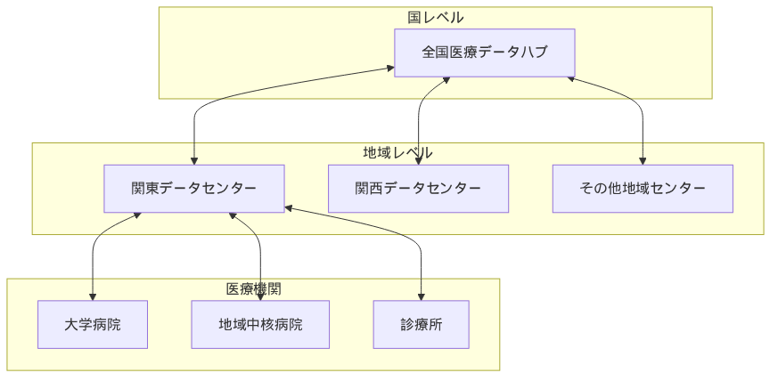

## 医療データスペースアーキテクチャ設計原則

### 1. 分散型フェデレーション

::: {.fact}
**事実**：EHDSは中央集権型ではなく、各国のシステムを連携させるフェデレーション型を採用している。EHDS規則（EU 2025/327）では、一次利用（MyHealth@EU）において各加盟国のNational Contact Point for eHealth（NCPeH）を接続し、二次利用（HealthData@EU）では「新たな分散型EUインフラストラクチャ」を通じて各国のHealth Data Access Bodiesを連携させることが明記されている[@EHDS_Regulation2025]。これにより既存システムを活かしつつ相互運用性を実現している。
:::

**日本での実装アプローチ例**：

{width=100%}

::: {.callout-note}
**注記**: 上図は日本でEHDS類似のフェデレーション型データスペースを構築する場合の一例である。実際の実装では、既存の医療情報システムや法制度との整合性を考慮した設計が必要となる。
:::

### 2. API ファースト設計とクエリファースト

::: {.fact}
**事実**：EHDSの二次利用（HealthData@EU）では、セキュアプロセッシング環境（SPE）の使用が義務付けられている。SPEを通じたデータアクセスの制御と、個人データの直接的な移転を制限する仕組みにより、データのセキュリティと個人情報保護を確保している。このアプローチは、データの移動を最小限に抑え、管理された環境での分析を可能にする「Compute-to-Data」の考え方と合致している[@EHDS_Regulation2025; @TEHDAS2023]。
:::

**設計原則**：

- **APIファースト**: 標準化されたインターフェースによる相互運用性の確保
- **セキュアプロセッシング**: SPE内でのデータ処理により、データ移動を最小化
- **プライバシー保護**: 個人識別可能データの環境外流出を防止
- **クエリ指向**: データの場所で分析を実行し、集計結果のみを返却

**API設計の選択肢**：

| 項目 | 主要技術選択肢 | 考慮点 |
|------|----------|------|
| プロトコル | REST/GraphQL + FHIR Search | 標準性と医療データ特化 |
| データ形式 | FHIR JSON | 国際標準準拠 |
| クエリエンジン | FHIR Search Parameters + SQL on FHIR | フェデレーテッド分析対応 |
| 認証 | OAuth 2.0 + OpenID Connect | セキュリティと利便性 |
| API Gateway | エンタープライズAPI管理ツール | 実績・機能・拡張性 |
| ドキュメント | OpenAPI 3.0 | 自動生成と標準化 |

### 3. データローカリティとプライバシー保護

::: {.fact}
**事実**：EHDSでは、セキュアプロセッシング環境（SPE）内でのデータ処理が義務付けられ、個人データの直接的な移転を制限している。これにより「Compute-to-Data」の考え方を実現し、データの移動を最小限に抑えながら分析を可能にしている[@EHDS_Regulation2025; @TEHDAS2023]。
:::

**設計コンセプト**：

- **データレジデンシー**: 医療データの地理的配置を法制度に応じて制御
- **プライバシー by Design**: GDPR・個人情報保護法準拠の組み込み設計
- **監査証跡**: すべてのデータアクセスと操作の完全な記録・追跡

**実装戦略**：

医療データの地理的配置を法制度とシステム要件に応じて最適化し、データの物理的な配置場所を明確に制御する設計が重要である。

**日本の法的要件**：

改正次世代医療基盤法（2024年4月施行）では、認定事業者に対して「医療情報セキュリティに関する3省2ガイドラインを準拠し得ることが担保されているクラウドサービス」の利用が明示的に許可されている。また、「診療録等の保存を行う場所について」（平成14年3月29日医政発第0329003号・保発第0329001号）により、電磁的記録による外部保存において記録の真正性、見読性、保存性の確保が条件として定められている。

## 日本の次世代医療基盤法とEHDSの技術的整合性

::: {.fact}
**事実**：2024年4月施行の改正次世代医療基盤法では、仮名加工医療情報の利活用とNDB等公的データベースとの連結が可能となった。認定事業者には「安全管理措置に関する基準」の遵守が義務付けられ、理研等では「セキュアな研究データ解析環境」を開発・運用している。一方、EHDSではセキュアプロセッシング環境（SPE）での処理が義務付けられており、両制度ともセキュアな環境でのデータ処理を重視している。日本は国際標準のHL7 FHIRを採用し、電子カルテ情報共有サービスで「3文書6情報」の共有を開始している[@NextGenMedLaw2024; @MHLW2024]。
:::

### 技術的ギャップ分析と考察

| 要素 | 日本の現状 | EHDSの要求 | 考慮すべきアプローチ |
|------|------------|------------|----------------|
| **データ処理環境** | 認定事業者でのセキュア環境運用中 | SPE内での分析義務 | 国際標準準拠のSPE仕様策定 |
| **データ標準** | HL7 FHIR JP Core採用中 | FHIR R4/R5、EHRxF | JP CoreとEHRxFのマッピング開発 |
| **クエリ方式** | 個別データ提供中心 | Compute-to-Data必須 | フェデレーテッドクエリ基盤の導入 |
| **認証基盤** | マイナンバー、HPKI | eIDAS | 相互認証ゲートウェイの構築 |
| **公的DB連結** | 被保険者番号ハッシュ化 | 欧州標準識別子 | 国際標準対応の識別子変換層 |

### 日本の政策動向と技術実装

#### 現在進行中の施策（2024-2025年）
- **電子カルテ情報共有サービス**：2025年度中の本稼働を予定。3文書6情報（診療情報提供書、退院時サマリー、健康診断結果報告書、傷病名、アレルギー、感染症、薬剤禁忌、検査、処方）の共有が開始される[@MHLW_MedicalDX2024]
- **改正次世代医療基盤法**：2024年4月施行により仮名加工医療情報の利活用と公的データベース連結が可能となった。2025年2月に理研とアストラゼネカが初の認定事業者として認定[@NextGenMedLaw2024]
- **HL7 FHIR JP Core**：電子カルテ情報共有サービス対応版（JP-CLINS v1.11.0）とJP Core v1.2.0-aが整備済み[@JPCore2024]

#### 中期計画（2025-2030年）
- **標準型電子カルテ**：2025年早期にα版テスト開始、2026年以降の本格展開を予定。2030年には概ねすべての医療機関での導入を目標[@MHLW_MedicalDX2024]
- **全国医療情報プラットフォーム**：オンライン資格確認システムを拡充し、クラウド間連携による全国的なデータ共有基盤を構築[@MHLW_MedicalDX2024]
- **医療DX二次利用基盤**：2030年頃を目標とした研究利用環境の整備[@MHLW_MedicalDX2024]

