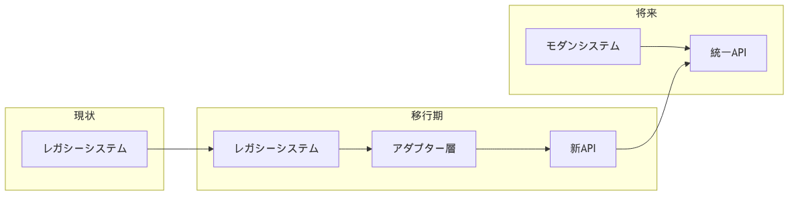
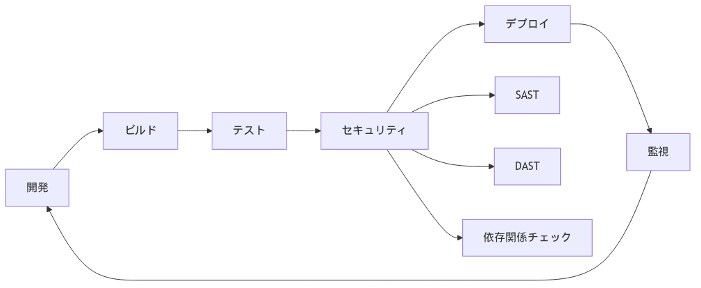

## アーキテクチャ設計原則

### 1. 分散型フェデレーション

::: {.fact}
**事実**：EHDSは中央集権型ではなく、各国のシステムを連携させるフェデレーション型を採用している。これにより既存システムを活かしつつ相互運用性を実現している。
:::

**日本での実装アプローチ**：

{width=100%}

### 2. API ファースト設計

**推奨API仕様**：

| 項目 | 推奨技術 | 理由 |
|------|----------|------|
| プロトコル | REST/GraphQL | 標準性と柔軟性 |
| データ形式 | FHIR JSON | 国際標準準拠 |
| 認証 | OAuth 2.0 + OpenID Connect | セキュリティと利便性 |
| API Gateway | Kong/Apigee | エンタープライズ実績 |
| ドキュメント | OpenAPI 3.0 | 自動生成と標準化 |

### 3. クラウドネイティブ

**コンテナ化戦略**：

```yaml
# Kubernetes deployment例
apiVersion: apps/v1
kind: Deployment
metadata:
  name: fhir-server
spec:
  replicas: 3
  selector:
    matchLabels:
      app: fhir-server
  template:
    metadata:
      labels:
        app: fhir-server
    spec:
      containers:
      - name: fhir-server
        image: jp-health-data/fhir-server:v2.0
        ports:
        - containerPort: 8080
        env:
        - name: DB_CONNECTION
          valueFrom:
            secretKeyRef:
              name: db-secret
              key: connection-string
```

### 4. ゼロトラストセキュリティ

::: {.callout-warning}
**重要**：従来の境界防御に加えて、全てのアクセスを検証するゼロトラストモデルの導入が推奨される。
:::

**実装要素**：

1. **アイデンティティ検証**
   - 多要素認証（MFA）
   - 継続的な認証
   - リスクベース認証

2. **デバイス管理**
   - MDM/EMM導入
   - デバイス証明書
   - コンプライアンスチェック

3. **ネットワークセグメンテーション**
   - マイクロセグメンテーション
   - Software Defined Perimeter
   - 最小権限アクセス

## 技術スタック推奨

### レイヤー別推奨技術

| レイヤー | 推奨技術 | 代替技術 | 選定理由 |
|----------|----------|----------|----------|
| **データ標準** | FHIR R4 | FHIR R5 | 国際標準、JP Core対応 |
| **API Gateway** | Kong | Apigee, AWS API Gateway | オープンソース、拡張性 |
| **認証・認可** | Keycloak | Auth0, Okta | オープンソース、SAML/OAuth対応 |
| **データベース** | PostgreSQL | MongoDB, CockroachDB | 信頼性、ACID準拠 |
| **検索エンジン** | Elasticsearch | Apache Solr | 医療用語検索対応 |
| **メッセージング** | Apache Kafka | RabbitMQ, AWS SQS | スケーラビリティ |
| **分析基盤** | Apache Spark | Databricks, Snowflake | ビッグデータ処理 |
| **コンテナ** | Kubernetes | Docker Swarm, ECS | デファクトスタンダード |
| **監視** | Prometheus + Grafana | Datadog, New Relic | オープンソース |

### 医療特化コンポーネント

**FHIR サーバー実装**：

| 実装 | ライセンス | 特徴 | 日本での採用実績 |
|------|------------|------|-----------------|
| HAPI FHIR | Apache 2.0 | 最も成熟、Java | あり |
| Microsoft FHIR Server | MIT | Azure統合 | 検討中 |
| IBM FHIR Server | Apache 2.0 | エンタープライズ向け | あり |
| Smile CDR | 商用 | 商用サポート | なし |

## 実装上の注意点

### レガシーシステムとの共存

::: {.fact}
**事実**：日本の病院の約70%が10年以上前の電子カルテシステムを使用している。完全な置き換えは現実的でない。
:::

**移行戦略**：

{width=100%}

### 段階的マイグレーション

**推奨マイグレーションパス**：

1. **Phase 1: Read-only API公開**（6ヶ月）
   - 既存データの読み取り専用API
   - FHIR形式への変換層実装
   - 監査ログ実装

2. **Phase 2: 双方向同期**（12ヶ月）
   - 書き込みAPI実装
   - データ同期メカニズム
   - 整合性チェック

3. **Phase 3: 新システム移行**（18ヶ月）
   - 新システムへの段階的切り替え
   - レガシーシステムの段階的廃止
   - データ移行完了

### ベンダーロックイン回避

::: {.analysis}
**考察**：特定ベンダーへの依存は、将来の柔軟性を損なう。オープンスタンダードとポータビリティを重視すべきである。
:::

**回避策**：

| 領域 | 対策 | 実装例 |
|------|------|--------|
| データ形式 | 標準規格採用 | FHIR、DICOM |
| API | オープンAPI仕様 | OpenAPI 3.0 |
| クラウド | マルチクラウド対応 | Kubernetes、Terraform |
| データベース | 標準SQL準拠 | PostgreSQL互換 |
| 認証 | 標準プロトコル | SAML、OAuth、OpenID Connect |

## パフォーマンス最適化

### スケーラビリティ設計

**負荷想定**：

| メトリクス | 現在 | 2027年 | 2030年 |
|------------|------|--------|--------|
| 同時接続数 | 1,000 | 10,000 | 100,000 |
| API呼び出し/秒 | 100 | 1,000 | 10,000 |
| データ容量 | 1TB | 100TB | 1PB |
| レスポンス時間 | <2秒 | <1秒 | <500ms |

### キャッシング戦略

```yaml
# Redis キャッシング設定例
cache:
  levels:
    - name: L1_Memory
      type: in-memory
      ttl: 60s
      size: 1GB
    
    - name: L2_Redis
      type: redis
      ttl: 600s
      size: 10GB
      
    - name: L3_CDN
      type: cloudfront
      ttl: 3600s
      locations: [tokyo, osaka, fukuoka]
```

## セキュリティ実装

### 暗号化要件

| データ状態 | 暗号化方式 | 鍵管理 |
|------------|------------|--------|
| 保存時 | AES-256-GCM | HSM/KMS |
| 転送時 | TLS 1.3 | 証明書自動更新 |
| 処理時 | 準同型暗号（研究段階） | TEE活用 |

### 監査ログ要件

::: {.callout-note}
**法的要件**：医療情報システムの安全管理ガイドライン第6.0版に準拠した監査ログの実装が必要。
:::

**必須記録項目**：
- アクセス日時
- ユーザーID
- 患者ID（匿名化）
- アクション種別
- アクセス元IP
- 成功/失敗
- データ項目

## 開発プロセス

### DevSecOps実践

{width=100%}

### CI/CDパイプライン

**推奨ツールチェーン**：

| フェーズ | ツール | 目的 |
|----------|--------|------|
| ソース管理 | GitLab/GitHub | バージョン管理 |
| CI | Jenkins/GitLab CI | 自動ビルド |
| テスト | Jest/Pytest | 単体・統合テスト |
| セキュリティ | SonarQube/Snyk | 脆弱性検査 |
| デプロイ | ArgoCD/Flux | GitOps |
| 監視 | Prometheus/Grafana | メトリクス収集 |