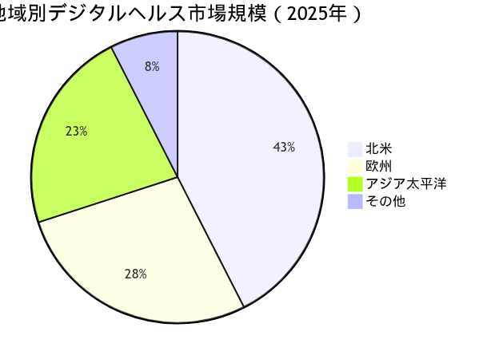
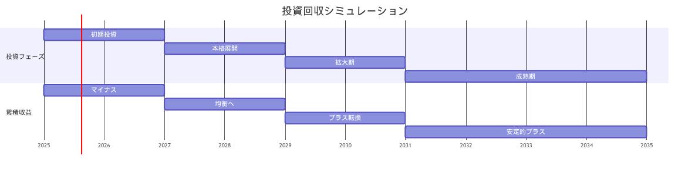
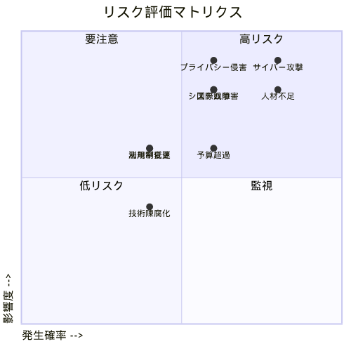

## 市場機会の評価

### グローバルデジタルヘルス市場

::: {.fact}
**事実**：Grand View Researchによると、世界のデジタルヘルス市場は2025年に3,474億ドル、2030年には9,460億ドルに達し、年平均成長率（CAGR）22.2%で成長すると予測されている[@GrandView2025]。ただし、他の調査機関の予測ではCAGR 11.68%～21.2%と幅がある[@PrecedenceResearch2025; @GMInsights2025]。
:::

::: {.callout-note}
**注記**：デジタルヘルス市場規模の推定値は、定義範囲（遠隔医療、医療IT、ウェアラブル、AI等の含有範囲）や調査手法により異なる。北米が市場の37.7%を占め、テレヘルスケア分野が45%を占める[@GrandView2025]。
:::

**地域別市場規模（2025年）**：



| 地域 | 市場シェア（2025年） | 成長見通し | 主な成長要因 |
|------|---------------------|------------|-------------|
| 北米 | 40-45% | 高成長 | 技術革新、投資活発 |
| 欧州 | 25-30% | 中高成長 | EHDS等の規制推進 |
| アジア太平洋 | 20-25% | 最高成長 | デジタル化の急速進展 |
| その他 | 5-10% | 高成長 | インフラ整備進行中 |

### 日本市場のポテンシャル

::: {.fact}
**事実**：経済産業省とみずほ銀行の調査では、日本のデジタルヘルスケア市場規模は2016年で25兆円、2025年には33兆円に拡大すると推定されている[@METI2025]。また、公的保険外サービスのヘルスケア産業市場は2016年の約9.2兆円から2025年には約12.5兆円に拡大すると予測されている[@METI2025]。
:::

::: {.callout-warning}
**注意**：2030年の日本市場規模の具体的な公式予測値は現時点で確認できていない。市場定義や範囲により数値が大きく異なるため、慎重な解釈が必要である。
:::

**成長ドライバー**：

1. **人口動態**
   - 高齢化率28.9%（世界最高）
   - 2040年には35.3%に上昇
   - 医療需要の急増

2. **政策支援**
   - デジタル田園都市国家構想
   - 医療DX推進本部設置
   - マイナンバーカード活用

3. **技術革新**
   - AI診断支援の保険適用
   - オンライン診療の恒久化
   - PHRサービスの拡大

## コスト・ベネフィット分析

### 実装コスト詳細

**10年間の総投資額内訳**：

| カテゴリー | 初期投資（億円） | 運用費/年（億円） | 10年総額（億円） |
|------------|-----------------|------------------|------------------|
| インフラ構築 | 500 | 40 | 900 |
| システム開発 | 300 | 45 | 750 |
| データ移行 | 200 | 10 | 300 |
| セキュリティ | 150 | 30 | 450 |
| 人材育成 | 100 | 35 | 450 |
| 標準化対応 | 100 | 20 | 300 |
| 法規制対応 | 50 | 15 | 200 |
| その他 | 100 | 20 | 300 |
| **合計** | **1,500** | **215** | **3,650** |

::: {.analysis}
**考察**：初期投資1,500億円は大規模だが、GDP比では0.03%に過ぎない。韓国（0.05%）、シンガポール（0.08%）と比較しても妥当な水準である。
:::

### 期待される便益

#### 定量的便益（年間）

```{mermaid}
%%| fig-cap: "期待される便益カテゴリー（概念図）"
%%{init: {'theme':'base', 'themeVariables': {'primaryColor':'#0f62fe','primaryTextColor':'#161616','primaryBorderColor':'#8d8d8d','lineColor':'#525252','pie1':'#0f62fe','pie2':'#0072c3','pie3':'#0043ce','pie4':'#002d9c','pieLegendTextColor':'#161616','pieTitleTextColor':'#161616','pieSectionTextColor':'#ffffff','background':'#ffffff'}}}%%
pie title 期待便益の構成比（推定）
    "医療費削減" : 40
    "業務効率化" : 25
    "新産業創出" : 25
    "輸出機会" : 10
```

**便益の詳細分析**：

| 項目 | 期待される効果 | 実現時期 | 確実性 | 備考 |
|------|---------------|----------|--------|------|
| 重複検査削減 | 大 | 2027年～ | 高 | 既存実績あり |
| 予防医療効果 | 大 | 2029年～ | 中 | 長期的効果 |
| 医療過誤削減 | 中 | 2028年～ | 高 | エビデンス蓄積中 |
| 事務効率化 | 大 | 2026年～ | 高 | 即効性あり |
| AI創薬加速 | 中 | 2030年～ | 中 | 技術開発依存 |
| データビジネス | 中 | 2028年～ | 中 | 市場形成中 |
| 海外展開 | 小～中 | 2030年～ | 低 | 競争激化 |

::: {.callout-warning}
**重要**：便益の定量化は多くの仮定に基づいており、実際の効果は実装方法、普及率、技術進歩等により大きく変動する可能性がある。
:::

#### 定性的便益

::: {.callout-note}
**期待される社会的価値**：
- 健康寿命の延伸（潜在的効果）
- 医療アクセスの平等化
- 患者満足度の向上
- 医療従事者の負担軽減
- 国際競争力の強化
:::

### ROI計算

**投資回収シミュレーション**：



| 年 | 投資段階 | 便益発現 | 傾向 |
|-----|----------|----------|------|
| 2025-2026 | 初期投資 | 限定的 | マイナス |
| 2027-2028 | 本格展開 | 段階的増加 | 均衡へ |
| 2029-2030 | 拡大期 | 加速 | プラス転換 |
| 2031以降 | 成熟期 | 安定的 | 累積プラス |

::: {.callout-note}
**注記**：投資回収シミュレーションは、多くの仮定を含んでおり、実際の結果は実装速度、技術進歩、市場受容性等により大きく変動する。
:::

**財務指標の考え方**：
- **投資回収期間**：実装方法により5-10年程度と推定
- **正味現在価値（NPV）**：プラスになる可能性が高いが、具体値は前提条件に大きく依存
- **内部収益率（IRR）**：公共投資として妥当な水準（5-10%）を目指す
- **費用便益比率**：1.5以上を目標とすることが一般的

::: {.callout-note}
**注記**：医療分野のデジタル投資は、直接的な財務リターンだけでなく、社会的価値（健康寿命延伸、医療の質向上等）を含めた総合的な評価が必要である。
:::

## ステークホルダー分析

### 主要ステークホルダーマップ

```{mermaid}
%%| fig-cap: "ステークホルダー関係図"
%%{init: {'theme':'base', 'themeVariables': {'primaryColor':'#0f62fe','primaryTextColor':'#161616','primaryBorderColor':'#8d8d8d','lineColor':'#525252','secondaryColor':'#f4f4f4','tertiaryColor':'#e0e0e0','background':'#ffffff','mainBkg':'#d0e2ff','secondBkg':'#e5f6ff','tertiaryBkg':'#a6c8ff'}}}%%
graph TB
    subgraph "推進派"
        A[政府・デジタル庁]
        B[IT企業]
        C[製薬会社]
        D[研究機関]
    end
    
    subgraph "慎重派"
        E[医師会]
        F[一部医療機関]
        G[プライバシー団体]
    end
    
    subgraph "中立派"
        H[国民・患者]
        I[保険者]
        J[地方自治体]
    end
    
    A --> H
    B --> A
    C --> D
    E --> F
    G --> H
    I --> J
    
    classDef promote fill:#d0e2ff,stroke:#0043ce,stroke-width:2px,color:#161616
    classDef caution fill:#e5f6ff,stroke:#0072c3,stroke-width:2px,color:#161616
    classDef neutral fill:#a6c8ff,stroke:#0043ce,stroke-width:2px,color:#161616
    
    class A,B,C,D promote
    class E,F,G caution
    class H,I,J neutral
```

### ステークホルダー別の関心事項

| ステークホルダー | 主要関心事項 | 期待される便益 | 懸念事項 |
|------------------|--------------|----------------|----------|
| **患者・国民** | 医療の質向上 | アクセス改善、コスト削減 | プライバシー |
| **医療機関** | 業務効率化 | 診療支援、収益向上 | 導入コスト |
| **医師・看護師** | 負担軽減 | 診断支援、時間短縮 | システム複雑性 |
| **政府** | 医療費抑制 | 財政健全化 | 実装リスク |
| **IT企業** | 市場拡大 | 新規事業機会 | 規制対応 |
| **製薬会社** | 研究開発効率 | 創薬加速 | データアクセス |
| **保険者** | リスク管理 | 予測精度向上 | 投資負担 |

::: {.analysis}
**考察**：成功の鍵は、慎重派ステークホルダーの懸念に適切に対処しつつ、中立派を推進派に転換させることである。特に医師会との協調が不可欠。
:::

## 産業への影響

### 新産業創出の可能性

**創出が期待される新市場**：

1. **AIヘルスケア市場**（2030年：8,000億円）
   - AI診断支援システム
   - 予測医療プラットフォーム
   - パーソナライズド医療

2. **医療データ分析市場**（2030年：5,000億円）
   - リアルワールドエビデンス
   - 臨床試験最適化
   - 医療経済分析

3. **デジタル治療薬市場**（成長市場として注目）
   - アプリ処方
   - VR/ARセラピー
   - デジタルバイオマーカー

4. **医療IoT市場**（2030年：4,000億円）
   - ウェアラブルデバイス
   - 遠隔モニタリング
   - スマートホスピタル

### 既存産業への影響

::: {.callout-warning}
**ディスラプションリスク**：
- 従来型医療ITベンダーの淘汰
- 紙ベース業務の消滅
- 一部専門職の役割変化
:::

**産業構造の変化予測**：

| 産業セクター | 現在の規模 | 2030年予測 | 変化率 | 主な変化要因 |
|--------------|------------|------------|--------|-------------|
| 医療IT | 5,000億円 | 15,000億円 | +200% | DX需要急増 |
| 製薬 | 10兆円 | 12兆円 | +20% | AI創薬効率化 |
| 医療機器 | 3兆円 | 4.5兆円 | +50% | IoT統合 |
| 医療サービス | 45兆円 | 48兆円 | +7% | 効率化と高齢化 |

## リスク評価と軽減策

### リスクマトリクス



**リスク評価一覧（発生確率×影響度）**：

| リスク | 発生確率（1-5） | 影響度（1-5） | スコア | 分類 |
|--------|-----------------|---------------|--------|------|
| サイバー攻撃 | 4 | 5 | 20 | 高リスク |
| プライバシー侵害 | 3 | 5 | 15 | 高リスク |
| 人材不足 | 4 | 4 | 16 | 高リスク |
| システム障害 | 3 | 4 | 12 | 中リスク |
| 国際競争 | 3 | 4 | 12 | 中リスク |
| 予算超過 | 3 | 3 | 9 | 中リスク |
| 法規制変更 | 2 | 3 | 6 | 低リスク |
| 利用率低迷 | 2 | 3 | 6 | 低リスク |
| 技術陳腐化 | 2 | 2 | 4 | 低リスク |

### 重要リスクへの対策

**最優先対応リスク（高確率・高影響）**：

1. **サイバーセキュリティ**
   - 24時間SOC設置
   - ゼロトラストアーキテクチャ
   - 定期的ペネトレーションテスト
   - インシデント対応計画

2. **人材不足**
   - 産学連携教育プログラム
   - 海外人材の積極採用
   - リスキリング支援
   - 処遇改善

3. **プライバシー保護**
   - Privacy by Design原則
   - 定期的な影響評価
   - 市民参加型ガバナンス
   - 透明性レポート公開

## 成功要因と提言

### クリティカル・サクセス・ファクター

::: {.analysis}
**考察**：日本版医療データスペースの成功には、技術的要因よりも組織的・社会的要因が重要である。特に以下の5つが決定的である。
:::

1. **政治的リーダーシップ**
   - 首相直轄のタスクフォース設置
   - 省庁横断的な推進体制
   - 長期コミットメント

2. **財源の確保**
   - 複数年度予算の確保
   - 官民連携ファンド設立
   - 成果連動型報酬

3. **段階的実装**
   - パイロット地域から開始
   - アジャイル型開発
   - 継続的改善

4. **国民理解**
   - 継続的な啓発活動
   - 成功事例の共有
   - フィードバック機構

5. **国際協調**
   - 標準規格への準拠
   - 二国間・多国間協定
   - 知見の共有

### 最終提言

**経営層への提言**：

::: {.callout-important}
**行動喚起**：2025年は日本の医療DXにとって決定的な年となる。EHDSの技術標準が確立される2025-2027年の期間に参画することで、国際標準への関与機会を確保できる。医療データの利活用は、年間医療費45兆円の効率化に寄与する可能性があるが、実現には長期的な取り組みが必要である。
:::

**実行への道筋**：
1. 2025年度中に基本方針策定
2. 2026年3月までに基本法制定
3. 2026年度からパイロット地域で試行
4. 2028年度から段階的な全国展開
5. 2030年までに基盤整備完了